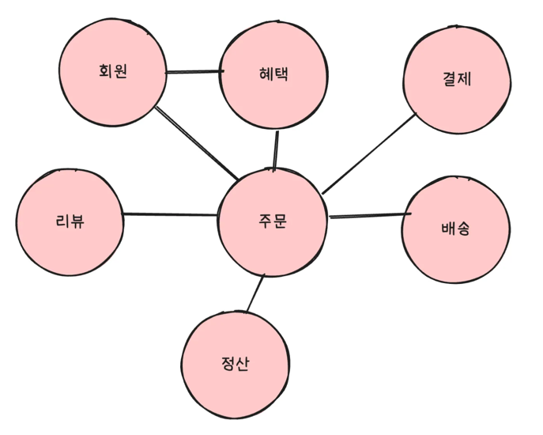
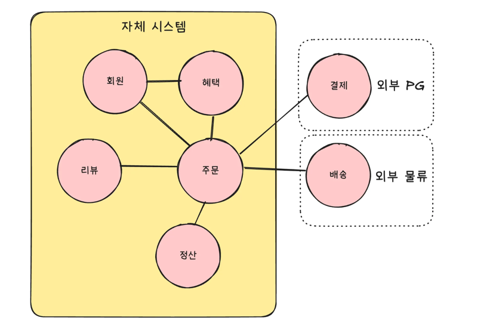
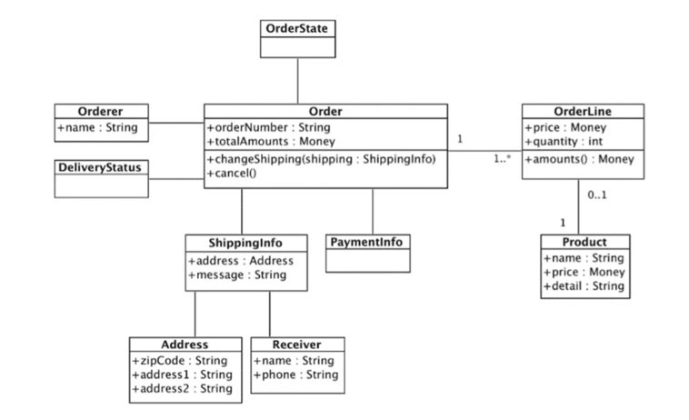
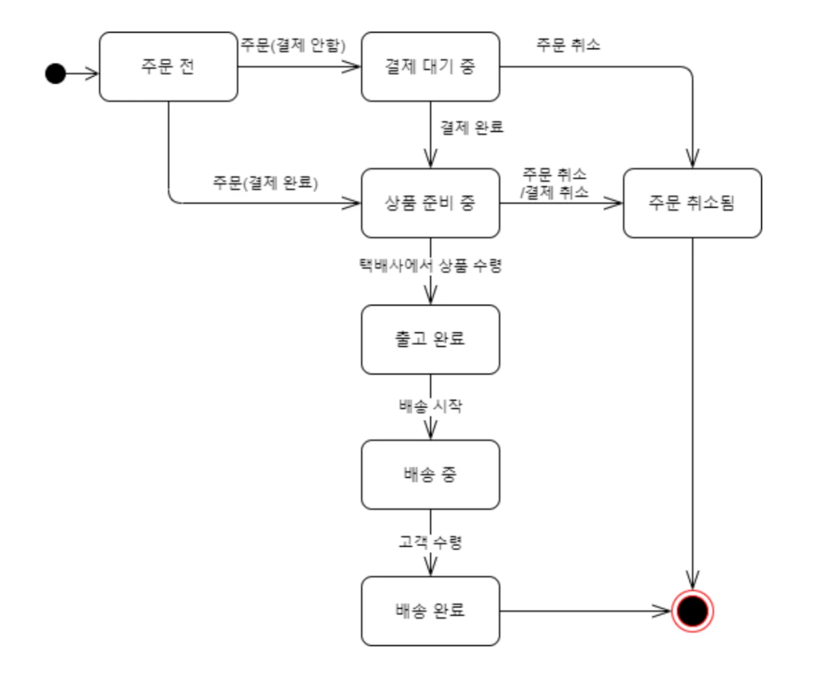
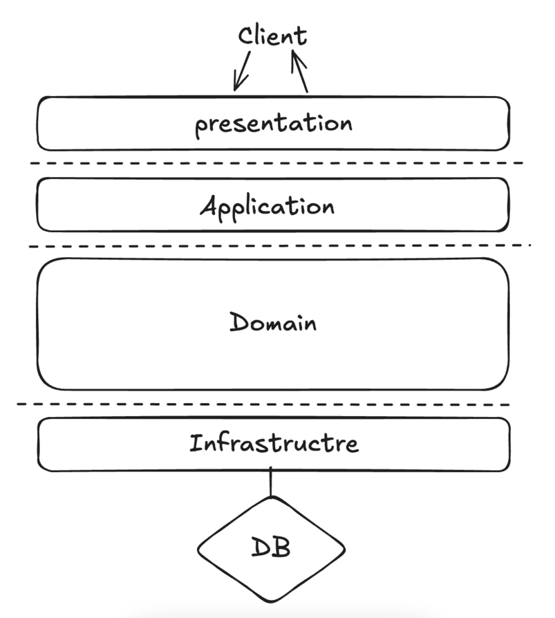
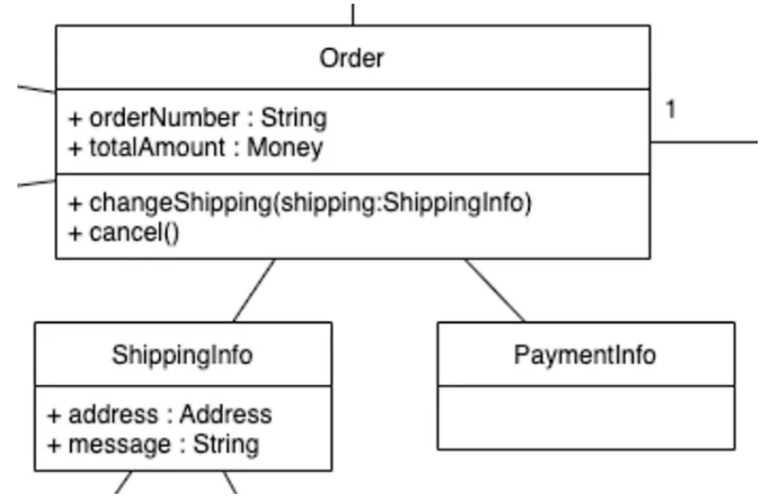

# DDD란

DDD(Domain-Driven Design). 직역하면 **도메인**을 이용한 디자인!

## 1. 도메인이란?

소프트웨어로 해결하고자 하는 **문제 영역**을 의미한다.

>온라인 쇼핑몰 서비스의  경우
>- 상품 관리, 주문 처리, 배송 관리, 고객 관리 등..

- 각각의 영역은 고유한 **규칙과** **정책**을 가진다.
- 한 도메인은 다시 하위 도메인으로 나뉠수도 있다.

쇼핑몰 도메인은 아래와 같이 몇개의 하위 도메인으로 나눌수도 있다.


- 각각의 하위 도메인들은 해당 도메인에서 처리할 수 있는 규칙과 정책으로 비즈니스를 담당한다.
- 하지만 특정 도메인을 위한 소프트웨어라고 해서 도메인이 제공해야할 모든 기능을 직접 다 구현하는 것은 아니다!
    - 예를 들어 배송,결제 시스템은 외부의 시스템을 연동하여 사용할 수도 있다.


## 2. 도메인 모델의 중요성

- 기본적으로 도메인 모델은 특정 도메인을 개념적으로 표현한 것
- 비즈니스 로직을 표현하는 수단
- 도메인 전문가와 개발자 간의 공통 언어 역할 (유비쿼터스 언어)

### 주문(Order) 모델을 객체 모델로 구성하면


이렇게 도메인 모델을 사용하면 여러 관계자들이 동일한 모습으로 도메인을 이해하고 도메인 지식을 공유하는데 도움이 된다!

더불어 아래 같은 상태 다이어그램을 이용하면 더욱 주문 모델링에 대하여 이해도가 높아진다.

## 3. 도메인 모델 패턴

일반적인 애플리케이션 아키텍처는 아래처럼 크게 네 개의 영역으로 구성된다.


| 영역 | 설명 |
| --- | --- |
| 사용자 인터페이스 OR 표현 영역
(Presentation) | 사용자의 요청을 처리하고 사용자에게 정보를 보여준다. **여기서 사용자는 소프트웨어를 사용하는 사람뿐만 아니라 외부 시스템 일수도 있다.** |
| Application | 사용자가 요청한 기능을 실행한다. **비즈니스 로직을 직접 구현하지 않으며** 도메인 계층을 조합해서 기능을 실행한다. 트랜잭션 처리 |
| Domain | 시스템이 제공할 도메인 규칙을 구현한다. |
| Infrastructure | DB나 메시징 시스템과 같은 외부 시스템과의 연동을 처리한다. |

## 4. 도메인 모델 도출
> 💡아무리 뛰어난 개발자라 할지라도 도메인에 대한 이해 없이 개발을 시작할 수는 없다.<br>
>기획서, 유즈케이스, 사용자 스토리와 같은 요구사항과 관련자의 대화를 통해 도메인을 이해하고 이를 바탕으로 도메인 모델 초안을 만들어야 비로소 안정적인 코드를 작성할 수 있다.

### 도메인을 모델링 할 때 기본이 되는 작업

- 모델을 구성하는 핵심 구성요소 찾기
- 규칙 찾기
- 기능 찾기

위의 과정은 **요구사항**에서 출발한다!!!

### `주문` 도메인과 관련된 몇가시 요구사항을 보자.

- 최소 한 종류 이상의 상품을 주문해야 한다.
- 한 상품을 한 개 이상 주문할 수 있다.
- 총 주문 금액은 각 상품의 구매 가격 합을 모두 더한 금액이다.
- 각 상품의 구매 가격 합은 상품 가격에 구매 개수를 곱한 값이다.
- 주문할때 배송지 정보를 반드시 지정해야 한다.
- 배송지 정보는 받는 사람 이름, 전화번호, 주소로 구성된다.
- 출고를 하면 배송지를 변경할 수 없다.
- 출고 전에 주문을 취소할 수 있다.
- 고객에 결제를 완료하기 전에는 상품을 준비하지 않는다.

이 요구사항에서 알 수 있는 것 

- 주문은 `'출고 상태로 변경하기'`, `'배송지 정보 변경하기'`, `'주문 취소하기'`, `'결제 완료하기'` 기능을 제공한다.

```java
public class Order {
	public void changeShipped() { ... }
	public void changeShippingInfo(ShippingInfo newShipping) { ... }
	public void cancel() { ... }
	public void completePayment() { ... }
}
```

아래 요구사항으로 주문항 목이 어떤 데이터로 구성되는지 알 수 있다.

- 한 상품을 한 개 이상 주문할 수 있다.
- 각 상품의 구매 가격 합은 상품 가격에 구매 개수를 곱한 값이다.

```java
//주문 항목을 표현하는 OrderLine
public class OrderLine {
	private Product product;
	private int price;
	private int quantity;
	private int amount;

	public OrderLine(ProductId productId, Money price, int quantity) {
        this.productId = productId;
        this.price = price;
        this.quantity = quantity;
        this.amounts = calculateAmounts();
    }

    private Money calculateAmounts() {
        return price.multiply(quantity);
    }
    
    ...
}
```

다음 요구사항은 `Order` <-> `OrderLine` 관계를 알려준다.

- 최소 한 종류 이상의 상품을 주문해야한다.
    - 한 종류 이상의 상품을 주문할 수 있으므로 Order는 최소 한 개 이상의 OrderLine을 가져야한다.
- 총 주문 금액은 각 상품의 구매 가격 합을 모두 더한 금액이다.
    - 총 주문 금액은 OrderLine에서 구할 수 있다.

```java
public class Order {
	private List<OrderLine> orderLines;
    private Money totalAmounts;
    
    public Order(List<OrderLine> orderLines) {
        setOrderLines(orderLines);
    }
    
    private void setOrderLines(List<OrderLine> orderLines) {
        verifyAtLeastOneOrMoreOrderLines(orderLines);
        this.orderLines = orderLines;
        calculateTotalAmounts();
    }

    private void verifyAtLeastOneOrMoreOrderLines(List<OrderLine> orderLines) {
        if (orderLines == null || orderLines.isEmpty()) {
            throw new IllegalArgumentException("no OrderLine");
        }
    }

    private void calculateTotalAmounts() {
        this.totalAmounts = new Money(orderLines.stream()
                .mapToInt(x -> x.getAmounts().getValue()).sum());
    }
}
```

## 5. 엔티티와 밸류

위의 작업에서 도출한 모델은 크게 엔티티(Entity)와 밸류(Value)로 구분할 수 있다.
>엔티티와 밸류를 제대로 구분해야 모데인을 올바르게 설계하고 구현할 수 있기 때문에, 이 둘의 차이를 명확하게 이해하는 것은 도메인을 구현하는 데 있어 중요하다.



### 1) 엔티티

- 식별자를 가지는 도메인 모델의 객체
- 식별자가 같으면 같은 엔티티로 간주

예를 들어 주문 도메인에서 각 주문은 주문번호를 가지고 있는데 이 주문번호는 각 주문마다 서로 다르다.

따라서 주문번호가 주문의 식별자가 된다.

### 2) 엔티티의 식별자 생성

- 특정 규칙에 따라 생성
    - 주문번호, 운송장번호, 카드번호와 같은 식별자는 특정 규칙에 따라 생성한다.
    - 이 규칙은 도메인에 따라 다르고, 같은 주문번호라도 회사마다 다르다.
- 직접 생성: 사용자가 직접 입력
- 자동 생성: UUID, 시퀀스, 값 조합 등

### 3) 밸류 타입

- 개념적으로 완전한 하나를 표현하는 객체
- 식별자를 갖지 않음
- **불변 객체**로 구현하는 것을 권장

`ShippingInfo` 클래스는 받는 사람과 주소에 대한 데이터를 갖고 있다.

```java
public class ShippingInfo {
    private String receiverName; // 받는 사람
    private String receiverPhoneNumber // 받는 사람
    
    private String shippingAddress1; // 주소
    private String shippingAddress2; // 주소
    private String zipcode; // 주소
}
```

밸류 타입 `Address`, `Receiver` 클래스를 사용한 모습이다. 배송정보가 받는 사람과 주소로 구성된다는 것을 쉽게 알 수 있다.

- 밸류 타입의 장점은 밸류 타입을 위한 기능을 추가할 수 있다.
    - ex) Money 객체에서의 돈 계산, Address 객체에서의 주소 검증 등등..

```java
public class ShippingInfo {
    private Address address;
    private Receiver receiver;
    
    /** 해당 밸류 타입에 대한 특수 검증이나 특수 기능을 추가할 수 있다. **/
}
```

## 6. 엔티티 식별자와 밸류 타입

>엔티티 식별자의 실제 데이터는 String과 같은 문자열로 구성된 경우가 많다. (JPA 생각 하지말고..!) <br> 
>하지만 Money가 단순 숫자가 아닌 도메인의 ‘돈’을 의미하는 것처럼 이런 식별자는 단순한 문자열이 아니라 도메인에서 특별한 의미를 지니는 경우가 많기 때문에 식별자를 위한 밸류 타입을 사용해서 **의미를 잘 드러내자!!**

## 7. 도메인 모델에 set 메서드 넣지 않기

- set 메서드는 도메인의 의미나 의도를 표현하지 못함
- 의미가 드러나는 메서드 사용

```java
public class Order {
    ...

    public void setShippingInfo(ShippingInfo shippingInfo) {
        if (shippingInfo == null) throw new IllegalArgumentException("no shipping info");
        this.shippingInfo = shippingInfo;
    }
    
    public void setOrderState(OrderState state) { ...}
}
// setShippingInfo() 메서드는 단순히 배송지 값을 설정한다는 것을 의미한다.
// setOrderState()는 단순히 주문 상태 값을 설정한다는 것을 의미한다. 
```

- `setOrderState()`는 단순히 상태값만 변경할지 아니면 상태값에 따라 다른 처리를 위한 코드를 함께 구현할지 애매하다.
- 습관적으로 작성한 set 메서드는 필드값만 변경하고 끝나기 때문에 상태 변경과 관련된 도메인 지식이 코드에서 사라지게된다.

```java
// set 메서드로 데이터를 전달하도록 구현하면, 처음 Order를 생성하는 시점에 order는 완전하지 않다.
Order order = new Order();

// set 메서드로 필요한 모든 값을 전달해야한다.
setOrderLines(orderLines);
setShippingInfo(shippingInfo);

// 주문자(Orderer)를 설정하지 않은 상태에서 주문 완료 처리
order.setState(OrderState.PREPARING);
```

- 주문자 설정이 누락된 코드다. 주문자 정보를 담고있는 필드인 orderler가 null인 상황에서 setState() 메서드를 호출하여 상태값을 변경하였다.
- 이걸 해결하고자, setState() 메서드에 orderer 필드의 null 체크를 넣는 것도 맞지 않다.

도메인 객체가 불완전한 상태로 사용되는 것을 막으려면 생성 시점에 필요한 것을 전달해주어야 한다. 즉, 생성자를 통해 필요한 데이터를 모두 받아야한다.

```java
Order oder = new Order(orderer, lines, shippingInfo, OrderState.PREPARING);
```

```java
public class Order {
    ...

    public Order(OrderNo number, Orderer orderer, List<OrderLine> orderLines,
                 ShippingInfo shippingInfo, OrderState state) {
        setNumber(number);
        setOrderer(orderer);
        setOrderLines(orderLines);
        setShippingInfo(shippingInfo);
        this.state = state;
        this.orderDate = LocalDateTime.now();
        Events.raise(new OrderPlacedEvent(number.getNumber(), orderer, orderLines, orderDate));
    }

    private void setNumber(OrderNo number) {
        if (number == null) throw new IllegalArgumentException("no number");
        this.number = number;
    }

    private void setOrderer(Orderer orderer) {
        if (orderer == null) throw new IllegalArgumentException("no orderer");
        this.orderer = orderer;
    }

    private void setOrderLines(List<OrderLine> orderLines) {
        verifyAtLeastOneOrMoreOrderLines(orderLines);
        this.orderLines = orderLines;
        calculateTotalAmounts();
    }

    private void verifyAtLeastOneOrMoreOrderLines(List<OrderLine> orderLines) {
        if (orderLines == null || orderLines.isEmpty()) {
            throw new IllegalArgumentException("no OrderLine");
        }
    }

    private void calculateTotalAmounts() {
        this.totalAmounts = new Money(orderLines.stream()
                .mapToInt(x -> x.getAmounts().getValue()).sum());
    }

    private void setShippingInfo(ShippingInfo shippingInfo) {
        if (shippingInfo == null) throw new IllegalArgumentException("no shipping info");
        this.shippingInfo = shippingInfo;
    }
    
    ...
}
```

### `'private'` 메서드임에 주목하자.

- 이 코드의 set 메서드는 클래스 내부에서 데이터를 변경할 목적으로 사용된다.
    - private 이기 때문에 외부에서 데이터를 변경할 목적으로 set 메서드를 사용할 수 없다.
- 불변 밸류 타입을 사용하면 자연스럽게 밸류 타입에는 set 메서드를 구현하지 않는다.
- set 메서드를 구현해야할 특별한 이유가 없다면 불변 타입의 장점을 살릴 수 있도록 밸류 타입은 불변으로 구현한다.
