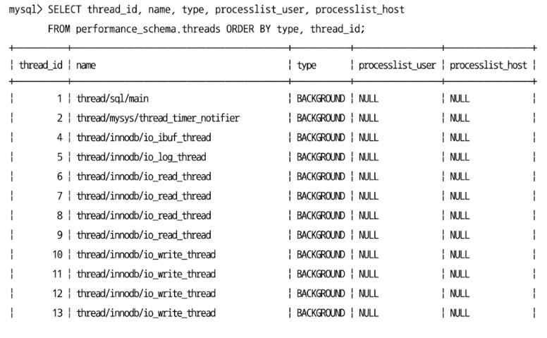
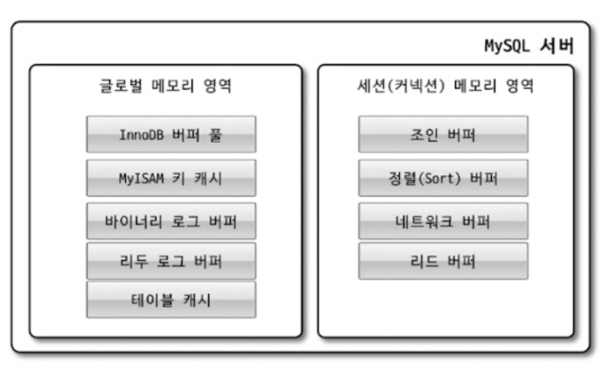

# 4. 아키텍처

### MySQL 서버는 크게 두가지로 나뉜다.
- MySQL 엔진 (사람으로 치면 머리 역할)
- 스토리지 엔진 (사람으로 치면 손/발)
  - 핸들러 API를 만족하면 누구든 스토리지 엔진을 구현해서 MySQL 서버에 추가해서 사용 가능하다.

이번 파트에서는 MySQL엔진과 MySQL 서버에서 기본으로 제공되는 `InnoDB` 스토리지 엔진, `MyISAM` 스토리지 엔진을 구분해서 살펴보자.

## 4.1 MySQL 엔진 아키텍처
먼저 MySQL의 쿼리를 작성하고 튜닝할 때 필요한 기본적인 MySQL 엔진의 구조를 훑어보자.<br>


MySQL은 일반 상용 RDBMS와 같이 대부분의 프로그래밍 언어로부터 접근 방법을 모두 지원한다.<br>

### MySQL 엔진
MySQL 엔진은 요청된 SQL 문장을 분석하거나 최적화하는 등 DBMS의 두뇌에 해당하는 처리를 수행한다.
아래를 토대로 중심을 이룬다.
- 클라이언트로부터의 접속 및 쿼리 요청을 처리하는 커넥션 핸들러
- SQL 파서
- 전문 처리기
- 쿼리의 최적화된 실행을 위한 옵티마이저

또한 표준 SQL(ANSI SQL) 문법을 지원하기 때문에 표준 문법에 따라 작성된 쿼리는 타 DBMS와 호환되어 실행될 수 있다.

### 스토리지 엔진
스토리지 엔진은 실제 데이터를 디스크 스토리지에 저장하거나 디스크 스토리지로부터 데이터를 읽어오는 부분을 담당한다.<br>
MySQL 서버에서 MySQL 엔진은 하나지만 스토리지 엔진은 여러 개 동시에 사용할 수 있다.<br>

다음과 같이 테이블이 사용할 스토리지 엔진을 지정하면 이후 해당 테이블의 모든 읽기 작업이나 변경 작업은 정의된 스토리지 엔진이 처리한다.
```sql
mysql> CREATE TABLE test_table (fd1 INT, fd2 INT) ENGINE=INNODB; //InnoDB 스토리지 엔진을 사용함.
```
또한 각 스토리지 엔진은 성능 향상을 위해 키 캐시(MyISAM 스토리지 엔진)나 InnoDB 버퍼 풀(InnoDB 스토리지 엔진)과 같은 기능을 내장하고 있다.

### 핸들러 API
MySQL 엔진의 쿼리 실행기에서 데이터를 쓰거나 읽어야 할 때는 각 스토리지 엔진에 쓰기 또는 읽기를 요청하는데, 이러한 요청을 핸들러(Handler) 요청이라고 한다.<br>
여기서 사용되는 API를 `API 핸들러`라고 한다.<br>
InnoDB 스토리지 엔진 또한 이 핸들러 API를 이용해 MySQL 엔진과 데이터를 주고 받는다.<br>


### MySQL 스레딩 구조
> MySQL 서버는 프로세스 기반이 아닌, 스레드 기반으로 동작한다. 크게 포그라운드(Foreground) 스레드와 백그라운드(Background) 스레드로 구분할 수 있다.



### 포그라운드 스레드(클라이언트 스레드)
- 포그라운드 스레드는 최소한 MySQL 서버에 접속된 클라이언트의 수만큼 존재한다.
  - 주로 각 클라이언트 사용자가 요청하는 쿼리 문장을 처리한다.
- 클라이언트 사용자가 작업을 마치고 커넥션 종료시 해당 커넥션의 스레드는 다시 스레드 캐시로 되돌아 간다.
  - 이때 이미 스레드 캐시에 일정 개수 이상의 대기중인 스레드가 있으면 스레드 캐시에 넣지 않고 스레드를 종료 시켜 일정 개수의 스레드만 스레드 캐시에 존재하도록 한다.
  - 최대 스레드 개수는 `thread_chache_size` 시스템 변수로 설정
- 데이터를 MySQL의 데이터 버퍼나 캐시로부터 가져온다.
  - 버퍼나 캐시에 없는 경우에는 직접 디스크의 데이터나 인덱스 파일로부터 데이터를 읽어와서 작업을 처리
  > - MyISAM 테이블 : 디스크 쓰기 작업까지 포그라운드 스레드가 처리
  > - InnoDB 테이블 : 데이터 버퍼나 캐시까지만 포그라운드 스레드가 처리하고 나머지 버퍼로부터 디스크까지 기록하는 작업은 백그라운드 스레드가 처리

### 백그라운드 스레드
MyISAM의 경우에는 별로 해당 사항이 없지만, InnoDB는 다음과 같이 여러 가지 작업이 백그라운드로 처리된다.
- 인서트 버퍼(Insert Buffer)를 병합하는 스레드
- **로그를 디스크로 기록하는 스레드**
- **InnoDB 버퍼 풀의 데이터를 디스크에 기록하는 스레드**
- 데이터를 버퍼로 읽어 오는 스레드
- 잠금이나 데드락을 모니터링 하는 스레드

InnoDB에서도 데이터를 읽는 작업은 주로 클라이언트 스레드에서 처리되기 때문에 읽기 스레드는 많이 설정할 필요가 없지만,<br>
쓰기 스레드는 아주 많은 작업을 백그라운드로 처리하기 때문에 일반적인 내장 디스크를 사용할 때는 2~4정도, DAS나 SAN과 같은 스토리지를 사용할 때는 디스크를 최적으로 사용할 수 있을 만큼 충분히 설정하는 것이 좋다.

- 클라이언트의 요청을 처리하는 도중 데이터의 쓰기 작업은 지연되어 처리될 수 있지만 데이터의 읽기 작업은 절대 지연될 수 없다.
  - 사용자가 SELECT 쿼리를 실행했는데, "요청된 SELECT는 10분 뒤에 결과를 돌려주겠다" 라고 응답을 보내는 DBMS 는 없다.
- 그래서 일반적인 상용 DBMS에는 대부분 쓰기 작업을 버퍼링해서 일괄 처리하는 기능이 탑재돼 있다.
  - InnoDB 또한 이러한 방식으로 처리
  - 하지만 MyISAM은 그렇지 않고 사용자 스레드가 쓰기 작업까지 함께 처리하도록 설계돼 있다.
  - 이러한 이유로 InnoDB에서는 `INSERT`, `UPDATE`, `DELETE` 쿼리로 데이터가 변경되는 경우 데이터가 디스크의 데이터 파일로 완전히 저장될 때까지 기다리지 않아도 됨. -> MyISAM에서 일반적인 쿼리는 쓰기 버퍼링 기능 사용X

### 메모리 할당 및 사용 구조

#### 글로벌 메모리 영역
- MySQL 서버가 시작되면서 운영체제로부터 할당된다.
- 운영체제의 종류에 따라 다르겠지만 요청된 메모리 공간을 100% 할당해줄 수도 있고, 그 공간만큼 예약해두고 필요할 때 조금씩 할당해주는 경우도 있다.
- 각 운영체제의 메모리 할당 방식은 복잡하므로, 그냥 단순하게 MySQL의 시스템 변수로 설정해 둔 만큼 운영체제로부터 메모리를 할당 받는다고 생각해도 된다.
- 일반적으로 **클라이언트 스레드의 수와 무관하게 하나의 메모리 공간만 할당된다.**
  - 단 필요에 따라 2개 이상의 메모리 공간을 할당받을 수도 있지만 클라이언트의 스레드 수와는 무관하다.
- 생성된 글로벌 영역이 N개라 하더라도 **모든 스레드에 의해 공유된다.**
> **대표적인 글로벌 메모리 영역**
>  - 테이블 캐시
>  - InnoDB 버퍼 풀
>  - InnoDB 어댑티브 해시 인덱스
>  - InnoDB 리두 로그 버퍼

#### 로컬 메모리 영역

- 세션 메모리 영역이라고도 표현한다.
- MySQL 서버상에 존재하는 클라이언트 스레드가 쿼리를 처리하는 데 사용하는 메모리 영역이다.
- 로컬 메모리는 각 클라이언트 스레드별로 독립적으로 할당되며 절대 공유되어 사용되지 않는다는 특징이 있다.
- 각 쿼리의 용도별로 필요할 때만 공간이 할당되고 필요하지 않은 경우에는 MySQL이 메모리 공간을 할당조차도 하지 않을 수도 있다.
  - 대표적으로 `소트 버퍼`, `조인 버퍼`와 같은 공간이 그러하다.
- 커넥션이 열려있는 동안 계속 할당된 상태로 남아 있는 공간도 있고(커넥션 버퍼, 결과 버퍼) 그렇지 않고 쿼리를 실행하는 순간에만 할당했다가 다시 해제하는 공간(소트 버퍼,조인 버퍼)도 있다.

> **대표적인 로컬 메모리 영역**
> - 정렬 버퍼(Sort Buffer)
> - 조인 버퍼
> - 바이너리 로그 캐시
> - 네트워크 버퍼

### 플러그인 스토리지 엔진 모델
MySQL의 독특한 구조 중 대표적인 것이 바로 플러그인 모델이다.<br>
MySQL의 구조는 대표적으로 플러그인 모델을 사용한다. 플러그인 모델을 사용하면 기존의 기능을 커스텀하게 확장할 수 있거나, 손쉽게 업그레이드할 수 있다.<br>
스토리지 엔진을 포함하여 인증이나 전문 검색 파서, 쿼리 재작성, 비밀번호 검증, 커넥션 제어 등 모두 플러그인 형태로 지원한다.

다만, 단점이 몇가지 있다.<br>
플러그인끼리는 통신할 수 없고, 플러그인은 MySQL 서버의 변수나 함수를 직접 호출하기 때문에 안전하지 않다.<br>
또한, 플러그인은 상호 의존 관계를 설정할 수 없어서 초기화가 어렵다.
