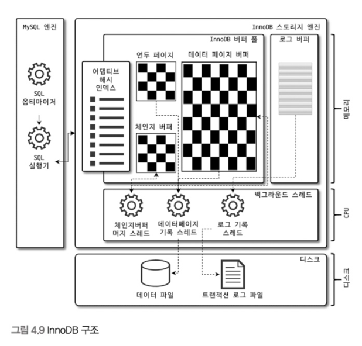

# 4. 아키텍처

### MySQL 서버는 크게 두가지로 나뉜다.
- MySQL 엔진 (사람으로 치면 머리 역할)
- 스토리지 엔진 (사람으로 치면 손/발)
  - 핸들러 API를 만족하면 누구든 스토리지 엔진을 구현해서 MySQL 서버에 추가해서 사용 가능하다.

이번 파트에서는 MySQL엔진과 MySQL 서버에서 기본으로 제공되는 `InnoDB` 스토리지 엔진, `MyISAM` 스토리지 엔진을 구분해서 살펴보자.

## 4.1 MySQL 엔진 아키텍처
먼저 MySQL의 쿼리를 작성하고 튜닝할 때 필요한 기본적인 MySQL 엔진의 구조를 훑어보자.<br>


MySQL은 일반 상용 RDBMS와 같이 대부분의 프로그래밍 언어로부터 접근 방법을 모두 지원한다.<br>

### MySQL 엔진
MySQL 엔진은 요청된 SQL 문장을 분석하거나 최적화하는 등 DBMS의 두뇌에 해당하는 처리를 수행한다.
아래를 토대로 중심을 이룬다.
- 클라이언트로부터의 접속 및 쿼리 요청을 처리하는 커넥션 핸들러
- SQL 파서
- 전문 처리기
- 쿼리의 최적화된 실행을 위한 옵티마이저

또한 표준 SQL(ANSI SQL) 문법을 지원하기 때문에 표준 문법에 따라 작성된 쿼리는 타 DBMS와 호환되어 실행될 수 있다.

### 스토리지 엔진
스토리지 엔진은 실제 데이터를 디스크 스토리지에 저장하거나 디스크 스토리지로부터 데이터를 읽어오는 부분을 담당한다.<br>
MySQL 서버에서 MySQL 엔진은 하나지만 스토리지 엔진은 여러 개 동시에 사용할 수 있다.<br>

다음과 같이 테이블이 사용할 스토리지 엔진을 지정하면 이후 해당 테이블의 모든 읽기 작업이나 변경 작업은 정의된 스토리지 엔진이 처리한다.
```sql
mysql> CREATE TABLE test_table (fd1 INT, fd2 INT) ENGINE=INNODB; //InnoDB 스토리지 엔진을 사용함.
```
또한 각 스토리지 엔진은 성능 향상을 위해 키 캐시(MyISAM 스토리지 엔진)나 InnoDB 버퍼 풀(InnoDB 스토리지 엔진)과 같은 기능을 내장하고 있다.

### 핸들러 API
MySQL 엔진의 쿼리 실행기에서 데이터를 쓰거나 읽어야 할 때는 각 스토리지 엔진에 쓰기 또는 읽기를 요청하는데, 이러한 요청을 핸들러(Handler) 요청이라고 한다.<br>
여기서 사용되는 API를 `API 핸들러`라고 한다.<br>
InnoDB 스토리지 엔진 또한 이 핸들러 API를 이용해 MySQL 엔진과 데이터를 주고 받는다.<br>


### MySQL 스레딩 구조
> MySQL 서버는 프로세스 기반이 아닌, 스레드 기반으로 동작한다. 크게 포그라운드(Foreground) 스레드와 백그라운드(Background) 스레드로 구분할 수 있다.


### 포그라운드 스레드(클라이언트 스레드)
- 포그라운드 스레드는 최소한 MySQL 서버에 접속된 클라이언트의 수만큼 존재한다.
  - 주로 각 클라이언트 사용자가 요청하는 쿼리 문장을 처리한다.
- 클라이언트 사용자가 작업을 마치고 커넥션 종료시 해당 커넥션의 스레드는 다시 스레드 캐시로 되돌아 간다.
  - 이때 이미 스레드 캐시에 일정 개수 이상의 대기중인 스레드가 있으면 스레드 캐시에 넣지 않고 스레드를 종료 시켜 일정 개수의 스레드만 스레드 캐시에 존재하도록 한다.
  - 최대 스레드 개수는 `thread_chache_size` 시스템 변수로 설정
- 데이터를 MySQL의 데이터 버퍼나 캐시로부터 가져온다.
  - 버퍼나 캐시에 없는 경우에는 직접 디스크의 데이터나 인덱스 파일로부터 데이터를 읽어와서 작업을 처리
  > - MyISAM 테이블 : 디스크 쓰기 작업까지 포그라운드 스레드가 처리
  > - InnoDB 테이블 : 데이터 버퍼나 캐시까지만 포그라운드 스레드가 처리하고 나머지 버퍼로부터 디스크까지 기록하는 작업은 백그라운드 스레드가 처리

### 백그라운드 스레드
MyISAM의 경우에는 별로 해당 사항이 없지만, InnoDB는 다음과 같이 여러 가지 작업이 백그라운드로 처리된다.
- 인서트 버퍼(Insert Buffer)를 병합하는 스레드
- **로그를 디스크로 기록하는 스레드**
- **InnoDB 버퍼 풀의 데이터를 디스크에 기록하는 스레드**
- 데이터를 버퍼로 읽어 오는 스레드
- 잠금이나 데드락을 모니터링 하는 스레드

InnoDB에서도 데이터를 읽는 작업은 주로 클라이언트 스레드에서 처리되기 때문에 읽기 스레드는 많이 설정할 필요가 없지만,<br>
쓰기 스레드는 아주 많은 작업을 백그라운드로 처리하기 때문에 일반적인 내장 디스크를 사용할 때는 2~4정도, DAS나 SAN과 같은 스토리지를 사용할 때는 디스크를 최적으로 사용할 수 있을 만큼 충분히 설정하는 것이 좋다.

- 클라이언트의 요청을 처리하는 도중 데이터의 쓰기 작업은 지연되어 처리될 수 있지만 데이터의 읽기 작업은 절대 지연될 수 없다.
  - 사용자가 SELECT 쿼리를 실행했는데, "요청된 SELECT는 10분 뒤에 결과를 돌려주겠다" 라고 응답을 보내는 DBMS 는 없다.
- 그래서 일반적인 상용 DBMS에는 대부분 쓰기 작업을 버퍼링해서 일괄 처리하는 기능이 탑재돼 있다.
  - InnoDB 또한 이러한 방식으로 처리
  - 하지만 MyISAM은 그렇지 않고 사용자 스레드가 쓰기 작업까지 함께 처리하도록 설계돼 있다.
  - 이러한 이유로 InnoDB에서는 `INSERT`, `UPDATE`, `DELETE` 쿼리로 데이터가 변경되는 경우 데이터가 디스크의 데이터 파일로 완전히 저장될 때까지 기다리지 않아도 됨. -> MyISAM에서 일반적인 쿼리는 쓰기 버퍼링 기능 사용X

### 메모리 할당 및 사용 구조

#### 글로벌 메모리 영역
- MySQL 서버가 시작되면서 운영체제로부터 할당된다.
- 운영체제의 종류에 따라 다르겠지만 요청된 메모리 공간을 100% 할당해줄 수도 있고, 그 공간만큼 예약해두고 필요할 때 조금씩 할당해주는 경우도 있다.
- 각 운영체제의 메모리 할당 방식은 복잡하므로, 그냥 단순하게 MySQL의 시스템 변수로 설정해 둔 만큼 운영체제로부터 메모리를 할당 받는다고 생각해도 된다.
- 일반적으로 **클라이언트 스레드의 수와 무관하게 하나의 메모리 공간만 할당된다.**
  - 단 필요에 따라 2개 이상의 메모리 공간을 할당받을 수도 있지만 클라이언트의 스레드 수와는 무관하다.
- 생성된 글로벌 영역이 N개라 하더라도 **모든 스레드에 의해 공유된다.**
> **대표적인 글로벌 메모리 영역**
>  - 테이블 캐시
>  - InnoDB 버퍼 풀
>  - InnoDB 어댑티브 해시 인덱스
>  - InnoDB 리두 로그 버퍼

#### 로컬 메모리 영역

- 세션 메모리 영역이라고도 표현한다.
- MySQL 서버상에 존재하는 클라이언트 스레드가 쿼리를 처리하는 데 사용하는 메모리 영역이다.
- 로컬 메모리는 각 클라이언트 스레드별로 독립적으로 할당되며 절대 공유되어 사용되지 않는다는 특징이 있다.
- 각 쿼리의 용도별로 필요할 때만 공간이 할당되고 필요하지 않은 경우에는 MySQL이 메모리 공간을 할당조차도 하지 않을 수도 있다.
  - 대표적으로 `소트 버퍼`, `조인 버퍼`와 같은 공간이 그러하다.
- 커넥션이 열려있는 동안 계속 할당된 상태로 남아 있는 공간도 있고(커넥션 버퍼, 결과 버퍼) 그렇지 않고 쿼리를 실행하는 순간에만 할당했다가 다시 해제하는 공간(소트 버퍼,조인 버퍼)도 있다.

> **대표적인 로컬 메모리 영역**
> - 정렬 버퍼(Sort Buffer)
> - 조인 버퍼
> - 바이너리 로그 캐시
> - 네트워크 버퍼

### 플러그인 스토리지 엔진 모델
MySQL의 독특한 구조 중 대표적인 것이 바로 플러그인 모델이다.<br>
MySQL의 구조는 대표적으로 플러그인 모델을 사용한다. 플러그인 모델을 사용하면 기존의 기능을 커스텀하게 확장할 수 있거나, 손쉽게 업그레이드할 수 있다.<br>
스토리지 엔진을 포함하여 인증이나 전문 검색 파서, 쿼리 재작성, 비밀번호 검증, 커넥션 제어 등 모두 플러그인 형태로 지원한다.

다만, 단점이 몇가지 있다.<br>
플러그인끼리는 통신할 수 없고, 플러그인은 MySQL 서버의 변수나 함수를 직접 호출하기 때문에 안전하지 않다.<br>
또한, 플러그인은 상호 의존 관계를 설정할 수 없어서 초기화가 어렵다.

### 컴포넌트 아키텍처
MySQL 8.0부터 기존의 플러그인 아키텍처를 대체하기 위한 컴포넌트 아키텍처가 지원된다.<br>
대표적으로 비밀번호 검증 기능이 컴포넌트로 개선되었다.

### 쿼리 실행 구조


**1. 쿼리 파서**
- 사용자 요청으로 들어온 쿼리 문장을 토큰(MySQL이 인식할 수 있는 최소 단위의 어휘나 기호)으로 분리해 트리 형태의 구조로 만들어 내는 작업
- 쿼리 문장의 기본 문법 오류는 이 과정에서 발견되고 사용자에게 오류 메세지를 전달한다.

**2. 전처리기**
- 파서 과정에서 만들어진 파서 트리를 기반으로 쿼리 문장에 구조적인 문제점이 있는지 확인한다.
- 각 토큰을 테이블 이름이나 컬럼 이름, 또는 내장 함수와 같은 개체를 매핑해 해당 객체의 존재 여부와 객체의 존재 여부와 객체의 접근 권한 등을 확인하는 과정을 이 단계에서 수행한다.
- 실제 존재하지 않거나 권한상 사용할 수 없는 개체의 토큰은 이 단계에서 걸러진다.

**3. 옵티마이저**
- 사용자의 요청으로 들어온 쿼리 문장을 저렴한 비용으로 가장 빠르게 처리할지를 결정하는 역할을 담당한다.
  - DBMS의 두뇌에 해당한다.
- 결국 어떻게 하면 **옵티마이저가 더 나은 선택**을 할 수 있게 유도하는가를 파악하는 것이 중요하다.

**4. 실행 엔진**
- 실행 엔진과 핸들러는 손과 발에 비유할 수 있다.
- 만들어진 계획대로 각 핸들러에게 요청해서 받은 결과를 또 다른 핸들러 요청의 입력으로 연결하는 역할을 수행한다.

**5. 핸들러**
- MySQL 서버의 가장 밑단에서 MySQL 실행 엔진의 요청에 따라 데이터를 디스크로 저장하고 디스크로부터 읽어 오는 역할을 한다.
- 핸들러는 결국 스토리지 엔진을 의미한다.
- MyISAM 테이블을 조작하는 경우에는 핸들러가 MyISAM 스토리지 엔진이 되고, InnoDB 테이블을 조작하는 경우 핸들러가 InnoDB 스토리지 엔진이 된다.

### 복제
MySQL 서버에서 복제(Replication)는 MySQL 서버의 데이터를 다른 MySQL 서버로 복사하는 기능을 말한다.<br>
관련해서는 뒤 16장에서 다룬다.

### 쿼리 캐시
MySQL 서버는 SQL 실행결과를 메모리에 캐시하하는 쿼리 캐시(Query Cache)라는 기능을 **제공했다**.<br>
하지만 테이블의 데이터가 변경되면 캐시에 저장된 결과 중에서 변경된 테이블과 관련된 것들은 모두 삭제해야 했다. 그래서 계속된 동시 처리 성능 저하와 많은 버그의 원인이 되기도 했다.<br>
그리하여 **MySQL 8.0으로 올라오면서 쿼리 캐시는 MySQL 서버의 기능에서 완전히 제거되었다.**

### 스레드풀
MySQL 서버 엔터프라이즈 에디션은 스레드 풀 기능을 제공한다. 하지만 커뮤니티 에디션은 스레드 풀 기능을 지원하지 않는다.<br>
따라서 Percona Server에서 제공하는 스레드 풀 기능을 살펴보자.

> MySQL 엔터프라이즈 서버풀 vs Percona Server 스레드풀
> - MySQL 엔터프라이즈 스레드 풀은 MySQL 서버 프로그램에 내장됨
> - Percona Server의 스레드 풀은 플러그인 형태로 작동하게 구현됨

#### 스레드 풀의 사용 목적
**내부적으로 사용자의 요청을 처리하는 스레드 개수를 줄여서 동시 처리되는 요청이 많다 하더라도 MySQL 서버의 CPU가 제한된 개수의 스레드 처리에만 집중할 수 있게 해서 서버의 자원 소모를 줄이는 것**이다.

#### 스레드 풀 기능
- CPU 프로세서 친화도를 높이려면 CPU 코어의 개수와 스레드 그룹의 수를 맞추는 것이 좋다.
- 모든 스레드 그룹의 스레드가 각자 작업을 처리하고 있는 상태에서 새로운 쿼리 요청이 들어온다면, `thread_poll_stall_limit` 시간 동안 기다려야 스레드 풀이 요청을 처리할 수 있다.
  - 따라서 응답 시간에 민감한 서비스라면 thread_poll_stall_limit 시스템 변수를 적절히 낮춰서 설정해야 한다.
- 선순위 큐와 후순위 큐를 이용해서 특정 트랜잭션이나 쿼리를 우선적으로 처리할 수 있는 기능 제공한다.

### 트랜잭션 지원 메타데이터
MySQL 5.7버전까지 테이블의 구조를 FRM 파일에 저장하고 일부 스토어드 프로그램 또한 파일 기반으로 관리했다.<br>
하지만 이러한 파일 기반의 메타데이터는 생성 및 변경 작업이 트랜잭션을 지원하지 않기 때문에 테이블의 생성 또는 변경 도중에 MySQL서버가 비정상적으로 종료되면 일관되지 않은 상태로 남는 문제가 있었다.<br>

MySQL 8.0 버전부터는 이러한 문제점을 해결하기 위해 테이블의 구조 정보나 스토어드 프로그램의 코드 관련 정보를 모두 innoDB의 테이블에 저장하도록 개선됐다.
- MySQL DB는 통째로 `mysql.ibd`라는 테이블 스페이스에 저장되므로 `*.ibd` 파일과 함께 특별히 주의해야 한다.

## 4.2 InnoDB 스토리지 엔진 아키텍처
MySQL의 스토리지 엔진 가운데 가장 많이 사용되는 InnoDB 스토리지 엔진을 살펴보자.<br>
InnoDB는 
- MySQL에서 사용할 수 있는 스토리지 엔진 중 거의 유일하게 레코드 기반의 잠금을 제공한다.
- 그 때문에 높은 동시성 처리가 가능하고 안정적이며 성능이 뛰어나다.



### Primary 키에 의한 클러스터링
- InnoDB 테이블은 기본적으로 Primary Key에 의해 클러스터링된다.
  - 클러스터링된 테이블은 테이블의 데이터가 Primary Key의 순서대로 저장된다.
  - 모든 세컨더리 인덱스는 레코드의 주소 대신 Primary Key의 값을 논리적 주소로 사용한다.
  - 따라서 Primary Key를 사용한 Range Scan 조회는 빠르게 처리된다.
- MyISAM 테이블은 클러스터링되지 않는다.
  - 따라서 MyISAM 스토리지 엔진은 클러스터링 키를 지원하지 않는다.
    - 따라서 Primary Key와 세컨더리 인덱스는 구조적으로 차이가 없다.

> 클러스터링이란?
> - 어떤 정해진 컬럼 값을 기준으로 동일한 값을 가진 하나 이상의 테이블의 레코드를 같은 장소에 저장하는 **물리적**인 기법
> - 즉, 여기서는 PK 값에 의해 특정 레코드의 물리적인 저장 위치가 정해진다고 보면 된다.
> - B-Tree 구조를 채택하지 않고, 루트 노드 - 리프 노드 구조로만 구성되어 있다.
> - PK 값을 수정하게 되면 데이터의 물리적인 위치가 바뀌게 되므로, 절대 그러지 말자!!
>   - 정확하게는 DELETE 후 INSERT를 진행한다.

### 외래 키 지원
>외래 키에대한 지원은 InnoDB 스토리지 엔진 레벨에서 지원하는 기능으로 MyISAM 스토리지 엔진은 외래 키를 지원하지 않는다.<br>

외래 키의 주의점
- 외래 키는 개발 환경에서 좋은 가이드 역할을 할 수 있지만, 쿼리 실행에서 Lock이 여러 테이블로 전파되기 때문에 데드락이 발생할 때가 많다.
- 외래 키 관계 체크로 인해 수동으로 데이터를 적재하거나 스키마 변경시 작업이 실패할 수 있다.
  - 이는 `foreign_key_checks` 시스템 변수를 이용해 외래 키 체크를 일시적으로 비활성화할 수 있지만, 데이터를 적재한 후에 일관성을 맞춰준 후 다시 활성화해줘야 한다.
  - `foreign_key_checks`가 비활성화되면 외래키 관계의 부모 테이블에 대한 작업(`ON DELETE CASCADE` / `ON UPDATE CASCADE`)등이 동작하지 않는다.

### MVCC(Multi-Version Concurrency Control)
> - 일반적으로 레코드 레벨의 트랜잭션을 지원하는 DBMS가 제공하는 기능.
> - **잠금을 사용하지 않는 일관된 읽기를 제공하는 것이 가장 큰 목적**이다.

- `undo 로그`를 이용하여 구현한다.
- 격리 수준이 `READ_COMMITED에서` INSERT 후 UPDATE 작업을 수행할때, UPDATE로 일어나는 값의 변경은 우선 버퍼 풀에만 적용된다.
- 이때 `COMMIT` 또는 `ROLLBACK`이 되지 않았을 때, 다른 세션에서 위 `INSERT` 된 값을 조회할 때, 시스템 변수에 설정된 격리 수준에 따라 버퍼 풀 또는 undo 로그에 있는 값을 조회한다.
  - `READ_UNCOMMITED`에서는 현재 버퍼 풀에 있는 값을 조회
  - `READ_COMMITED` 이상의 격리 수준에서는 아직 커밋되지 않았기에, 변경되기 이전의 내용을 담고 있는 undo 로그에 있는 값을 조회

이러한 과정을 DBMS에서는 MVCC라고 표현한다.<br>
ROLLBACK은 undo 영역에 있는 데이터를 버퍼 풀로 다시 복구하고, undo 영역의 내용을 삭제한다.<br>
또한 COMMIT이 되면 버퍼 풀의 상태를 영구적인 데이터로 만드는데, 이 때 undo 영역이 바로 삭제되는 것은 아니고, 이 undo 영역을 필요로 하는 트랜잭션이 더는 없을 때 삭제된다.<br>
트랜잭션이 길어지면 undo 로그에 데이터가 오래 남게 되는데, 이는 성능에 악영향을 유발한다.
트랜잭션을 최대한 빠르게 끝내야 하는 이유가 이것이다.

### 잠금 없는 일관된 읽기 (Non-Locking Consistent Read)
- InnoDB 스토리지 엔진은 MVCC를 이용해 잠금 없는 일관된 읽기를 지원한다.<br>
- 격리 수준이 `SERIALIZABLE`이 아닌 경우에는 `INSERT`와 연결되지 않은 순수한 읽기 작업은 잠금을 대기를 하지 않고 바로 실행된다.
  - 특정 사용자가 레코드를 변경하고 아직 커밋을 수행하지 않았다 하더라도 이 변경 트랜잭션이 다른 사용자의 SELECT 쿼리에 영향을 주지 않는다.
  - 이를 `잠금 없는 일관된 읽기`라고 한다.
- InnoDB에서는 변경되지 전의 데이터를 읽기 위해 언두 로그를 사용한다.
