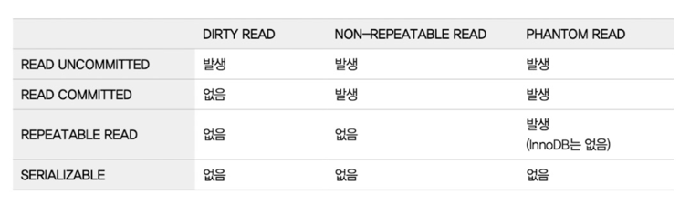
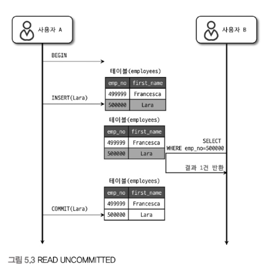
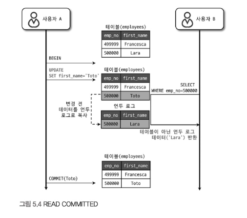
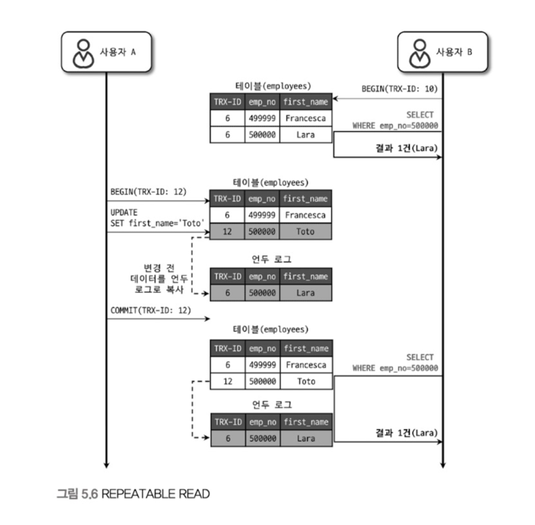
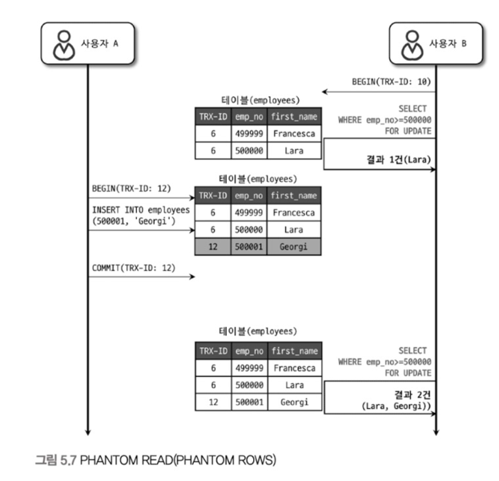

# 5. 트랜잭션과 잠금

> 트랜잭션은 작업의 완전성을 보장해 주는 것. <br>
> 즉 논리적인 작업 셋을 모두 완벽하게 처리하거나 or 처리하지 못할 경우 원 상태로 모두 복구해야한다.<br>
> **작업의 일부만 적용되는 현상(Partial update)이 발생하지 않게 만들어주는 기능**이다.

#### 잠금(Lock)과 트랜잭션

잠금과 트랜잭션은 서로 비슷한 개념 같지만

- 잠금은 동시성을 제어하기 위한 기능
- 트랜잭션은 데이터의 정합성을 보장하기 위한 기능

하나의 회원 정보 레코드를 여러 커넥션에서 동시에 변경하려고 하는데 잠금이 없다면 하나의 데이터를 여러 커넥션에서 동시에 변경할 수 있게 된다.<br>
**잠금은 여러 커넥션에서 동시에 동일한 자원(레코드나 테이블)을 요청할 경우 순서대로 한 시점에는 하나의 커넥션만 변경할 수 있게 해주는 역할을 한다.**<br>
**격리 수준이라는 것은 하나의 트랜잭션 내에서 또는 여러 트랜잭션 간의 작업 내용을 어떻게 공유하고 차단할 것인지를 결정하는 레벨을 의미한다.**

## 5.1 트랜잭션

> 트랜잭션은 꼭 여러 개의 변경 작업을 수행하ㅏ는 쿼리가 조합됐을 때만 의미 있는 개념은 아니다.<br>
> 트랜잭션은 하나의 논리적인 작업 셋에 하나의 쿼리가 있든 두 개 이상의 쿼리가 있든 관계없이 논리적인 작업 셋 자체가 100% 적용되거나(commit을 실행시) 아무것도 적용되지 않아야 (rollback 또는
> 트랜잭션을 rollback 시키는 오류가 발생시) 함을 보장해 주는 것이다.

## 5.2 MySQL 엔진의 잠금

### 글로벌 락

- **특징**: 전체 MySQL 서버에 영향을 미치는 가장 범위가 넓은 락
- **명령어**: `FLUSH TABLES WITH READ LOCK`
- **용도**: 주로 백업 시 사용되며, 모든 테이블에 대한 쓰기 작업 차단
- **영향**: 모든 데이터베이스의 모든 테이블에 적용되어 DDL 및 DML 구문 실행 불가

### 테이블 락

- **특징**: 특정 테이블 단위로 적용되는 락
- **명령어**: `LOCK TABLES 테이블명 READ/WRITE`
- **획득 방식**:
    - 명시적 획득: LOCK TABLES 구문
    - 묵시적 획득: ALTER TABLE 등의 DDL 구문 실행 시
- **범위**: 테이블 구조 또는 전체 데이터에 대한 접근 제어

### 네임드 락

- **특징**: 사용자가 명시적으로 이름을 지정하여 획득하는 락
- **명령어**: `GET_LOCK('락이름', 타임아웃)`
- **용도**: 특정 이름으로 식별되는 자원에 대한 동시성 제어
- **특성**: 세션 간 상호 배제(mutual exclusion) 제공

### 메타데이터 락

- **특징**: 데이터베이스 객체의 메타데이터에 대한 변경 제어
- **획득 시점**: DDL 구문 실행 시 자동 획득
- **용도**: 스키마 변경 작업 중 데이터 일관성 보장
- **관리**: performance_schema.metadata_locks 테이블을 통해 모니터링 가능

## 5.3 InnoDB 스토리지 엔진 잠금(Lock)

InnoDB 스토리지 엔진은 MySQL에서 제공하는 잠금과는 별개로 스토리지 엔진 내부에서 레코드 기반의 잠금 방식을 탑재하고 있다.<br>
InnoDB는 **레코드 기반의 잠금 방식** 때문에 MyISAM 보다는 훨씬 뛰어난 동시성 처리를 제공할 수 있다.

### 레코드 락

레코드 자체만을 잠그는 것을 레코드 락(Record lock, Record only lock) 이라고 하며, 다른 상용 DBMS 의 레코드 락과 동일한 역할을 한다.<br>
한 가지 중요한 차이는 InnoDB 스토리지 엔진은 **레코드 자체가 아니라 인덱스의 레코드를 잠근다는 점**이다. <br>
-> `레코드 자체를 잠그느냐, 아니면 인덱스를 잠그느냐는 상당히 크고 중요한 차이를 만든다.`
> InnoDB 에서는 대부분 보조 인덱스를 이용한 변경 작업은 넥스트 키 락 (Next key lock) 또는 갭 락 (Gap lock) 을 사용하지만 프라이머리 키 또는 유니크 인덱스에 의한 변경 작업에서는
> 갭 (Gap, 간격 )에 대해서는 잠그지 않고 **레코드 자체에 대해서만 락**을 건다.

- 특징: 테이블의 특정 레코드(행)에 대한 락
- 적용 범위: 인덱스 레코드에 적용됨
- 동작: SELECT ... FOR UPDATE, UPDATE, DELETE 쿼리 실행 시 획득
- 구현: 인덱스 레코드에 대한 락으로 구현되어 효율적인 동시성 제어

### 갭(Gap) 락

갭락은 레코드 자체가 아니라 레코드와 바로 인접한 레코드 사이의 간격만을 잠그는 것을 의미한다.

- 특징: 인덱스 레코드 사이의 간격(gap)에 대한 락
- 용도: 팬텀 리드(Phantom Read) 방지를 위해 사용
- 적용: REPEATABLE READ 격리 수준에서 기본 작동
- 영향: 특정 범위에 새로운 레코드가 삽입되는 것을 방지

### 넥스트-키(Next-Key) 락

레코드 락과 갭 락을 합쳐 놓은 형태의 잠금을 넥스트 키 락(Next key lock)이라고 한다. <br>
**즉 레코드 자체에도 락이 걸리고 레코드와 바로 인접한 레코드 사이의 간격도 잠군다.**
> STATEMENT 포맷의 바이너리 로그를 사용하는 MySQL 서버에서는 `REPEATABLE READ` 격리 수준을 사용해야 한다.<br>
> 또한 innodb_locks_unsafe_for_binlog 시스템 변수가 비활성화되면 (0으로 설정되면 )변경을 위해 검색하는 레코드에는 넥스트 키 락 방식으로 잠금이 걸린다.<br>
> InnoDB의 갭 락이나 넥스트 키 락은 바이너리 로그에 기록되는 쿼리가 레플리카 서버에서 실행될 때 소스 서버에서 만들어 낸 결과와 동일한 결과를 만들어내도록 보장하는 것이 주목적이다.<br>
> 그런데 의외로 넥스트 키 락과 갭 락으로 인해 데드락이 발생하거나 다른 트랜잭션을 기다리게 만드는 일이 자주 발생한다.<br>
> **가능하다면 바이너리 로그 포맷을 ROW 형태로 바꿔서 넥스트 키 락이나 갭 락을 줄이는 것이 좋다.**

- 특징: 레코드 락과 갭 락의 조합
- 적용 범위: 인덱스 레코드와 그 이전 갭을 함께 잠금
- 목적: 팬텀 로우 방지와 복제 일관성 보장
- 기본 동작: REPEATABLE READ 격리 수준의 기본 잠금 방식

#### 넥스트-키 락 작동 메커니즘

넥스트-키 락은 다음 두 가지 락이 결합된 형태이다.

- 레코드 락(Record Lock): 인덱스 레코드 자체에 대한 락
- 갭 락(Gap Lock): 인덱스 레코드 사이의 간격에 대한 락

```
인덱스 범위: ... | 40 | 50 | 60 | ...
                   ^    ^    ^
                   |    |    |
                   갭   레코드  갭
```

```sql
-- 기본적인 SELECT FOR UPDATE 구문
SELECT *
FROM employee
WHERE emp_no = 50 FOR UPDATE;
```

`emp_no = 50`인 레코드에 대한 넥스트-키 락은 해당 레코드와 그 앞뒤의 갭을 모두 잠그게 된다.

---

### 격리 수준에 따른 락 획득 차이

중요한 점은 트랜잭션 격리 수준에 따라 락의 종류와 범위가 다르게 적용된다는 것!

1. `READ COMMITTED` 격리 수준

```sql 
SET TRANSACTION ISOLATION LEVEL READ COMMITTED;
```

- 이 경우 SELECT FOR UPDATE는 **레코드 락(Record Lock)** 만 획득
- 실제 조회된 레코드만 잠그므로 팬텀 리드 방지 불가능


2. `REPEATABLE READ` 격리 수준 (MySQL InnoDB 기본값):

```sql
SET TRANSACTION ISOLATION LEVEL REPEATABLE READ;
```

- 이 경우 `SELECT FOR UPDATE`는 **넥스트-키 락(Next-Key Lock)** 을 획득
- 조회 조건에 해당하는 레코드와 해당 범위의 갭에 대한 락 모두 설정

---

### 자동 증가(Auto Increment) 락

MySQL에서는 자동 증가하는 숫자값을 추출(채번)하기 위해 `AUTO_INCREMENT`라는 칼럼 속성을 제공한다.<br>
> `AUTO_INCRENENT` 칼럼이 사용된 테이블에 동시에 여러 레코드가 INSERT 되는 경우, 저장되는 각 레코드는 중복되지 않고 저장된 순서대로 증가하는 일련번호 값을 가져야 한다.<br>
> InnoDB 스토리지 엔진에서는 이를 위해 내부적으로 `AUTO_INCREMENT`락(Auto increment lock) 이라고 하는 테이블 수준의 잠금을 사용한다.

- `AUTO_INCREMENT` 락은 INSERT 와 REPLACE 쿼리 문장과 같이 새로운 레코드를 저장하는 쿼리에서만 필요하며 , UPDATE나 DELETE등의 쿼리에서는 걸리지 않는다.
- `AUTO_INCREMENT` 락을 명시적으로 획득하고 해제하는 방법은 없다.
    - `AUTO_INCREMENT` 락은 아주 짧은 시간동안 걸렸다가 해제되는 잠금이라서 대부분의 경우 문제가 되지 않는다.

---

### 격리 수준과의 관계

락의 동작은 트랜잭션 격리 수준에 따라 영향을 받는다.

- `READ UNCOMMITTED`: 락 사용 최소화, 더티 리드 허용
- `READ COMMITTED`: 배타 락 사용, 커밋된 데이터만 읽기 가능
- `REPEATABLE READ`: 공유 락과 갭 락 사용으로 일관된 읽기 보장
- `SERIALIZABLE`: 모든 SELECT에 공유 락 사용, 완전한 직렬화 보장

## 5.4 MySQL의 격리 수준


> 격리 수준이 높아질수록 MySQL 서버의 처리 성능이 많이 떨어질 것으로 생각하는데, 사실 `SERIALIZABLE` 격리 수준이 아니라면 크게 성능의 개선이나 저하는 발생하지 않는다.

- `REPEATABLE READ` 격리 수준에서는 팬텀 리드가 발생할 수 있지만, InnoDB에서는 독특한 특성 때문에 REPEATABLE READ 격리 수준에서도 팬텀리드가 발생하지 않는다.
- 오라클은 주로 `READ COMMITED` 수준을 많이 사용한다.
- MySQL은 주로 `REPEATABLE READ`를 주로 사용한다.

### 1) READ UNCOMMITTED

READ UNCOMMITTED 격리 수준에서는 각 트랜잭션에서의 변경 내용이 COMMIT이나 ROLLBACK 여부에 상관없이 다른 트랜잭션에서 보인다.



> 1. A가 emp_no가 500000이고 first_name이 "Lara"인 새로운 사원을 Insert한다.
> 2. 사용자 B가 변경된 내용을 커밋 하기도 전에 B는 emp_no=500000인 사원을 검색하고 있다.
> 3. 하지만 B는 A가 INSERT한 사원의 정보를 커밋되지 않은 상태에서도 조회할 수 있다.
> 4. 문제는 사용자 A가 처리 도중 알 수 없는 문제가 발생해 INSERT된 내용을 롤백한다고 하더라도 여전히 B는 "Lara"가 정상적인 사원이라고 생각하고 계속 처리할 것이다.

이처럼 어떤 트랜잭션에서 처리한 작업이 완료되지 않았는데도 다른 트랜잭션에서 볼 수 있는 현상을 **더티 리드(Dirty Read)** 라고 한다.<br>
더티 리드가 허용되는 격리 수준이 READ UN-COMMITTED다.<br>
그래서 MySQL을 사용한다면 최소한 READ-COMMITED 이상의 격리 수준을 사용할 것을 권장한다.

### 2) READ COMMITTED

온라인 서비스에서 가장 많이 선택되는 격리 수준이다.<br>
이 레벨에서는 위에서 언급한 더티 리드 같은 현생은 발생하지 않는다.<br>
어떤 트랜잭션에서 데이터를 변경했더라도 `COMMIT`이 완료된 데이터만 다른 트랜잭션에서 조회할 수 있기 때문이다.



> 1. A 는 emp_no=500000인 사원의 first_name을 "Lara" 에서 "Toto" 로 변경했다.
> 2. 이때 새로운 값인 "Toto" 는 employees 테이블에 즉시 기록되고 이전 값인 "Lara" 는 언두 영역으로 백업된다.
> 3. A가 커밋을 수행하기 전에 사용자 B가 emp_no=500000인 사원을 SELECT 하면 조회된 결과의 first_name 칼럼의 값은 "Toto" 가 아니라 "Tara" 로 조회된다.
> 4. 여기서 사용자 B의 SELECT 쿼리 결과는 employees 테이블이 아니라 언두 영역에 백업된 레코드에서 가져온 것이다.

위의 이유는 `READ COMMITTED` 격리 수준에서는 어떤 트랜잭션에서 변경한 내용이 **커밋되기 전**까지는 다른 트랜잭션에서 그러한 변경 내역을 조회할 수 없기 때문이다.

#### 트랜잭션의 유무에 따른 SELECT 문

가끔 사용자 중에서 트랜잭션내에서 실행되는 SELECT 문장과 트랜잭션 없이 실행되는 SELECT 문장의 차이를 혼동하는 경우가 있다.<br>

- `READ COMMITTED`격리 수준에서는 트랜잭션내에서 실행되는 SELECT 문장과 트랜잭션 외부에서 실행되는 SELECT 문장의 차이가 별로 없다.
- 하지만 `REPEATABLE READ` 격리 수준에서는 기본적으로 SELECT 쿼리 문장도 트랜잭션 범위 내에서만 작동한다.
- 즉 , `START TRANSACTION`(또는 BEGIN) 명령으로 트랜잭션을 시작한 상태에서 온종일 동일한 쿼리를 반복해서 실행해 봐도 동일한 결과만 보게 된다.
    - 아무리 다른 트랜잭션에서 그 데이터를 변경하고 COMMIT 을 실행한다고 하더라도 말이다.

### 3) REPEATABLE READ

REPEATABLE READ 격리 수준은 MySQL의 기본 격리 수준이다.<br>
이 격리 수준에서는 READ COMMITTED 격리 수준에서 발생하는 `Non-Repeatable Read` 현상이 발생하지 않는다.<br>
InnoDB 스토리지 엔진은 트랜잭션이 RollBack 될 가능성에 대비하여 언두 영역에 백업된 레코드를 사용하기 때문에 트랜잭션이 시작된 시점의 스냅샷을 제공한다.<br>
이러한 변경 방식을 `MVCC(Multi-Version Concurrency Control)`라고 한다.<br>
> 사실 READ COMMITTED 격리 수준에서도 MVCC를 사용하여 커밋되기 전의 데이터를 보여준다.<br>
> REPEATABLE READ 와 READ COMMITTED 격리 수준의 차이는 언두 영역에 백업된 레코드의 여러 버전 가운데 몇번째 이전 버전까지 찾아 들어가야 하느냐에 있다.

모든 InnoDB의 트랜잭션은 고유한 트랜잭션 번호(순차적으로 증가하는 값)를 가지며, 언두 영역에 백업된 모든 레코드에는 변경을 발생시킨 트랜잭션의 번호가 포함돼 있다.<br>
그리고 언두 영역의 백업된 데이터는 InnoDB 스토리지 엔진이 불필요하다고 판단하는 시점에 주기적으로 삭제한다.<br>


> 사용자 A의 트랜잭션 번호는 12 였으며 사용자 B의 트랜잭션의 번호는 10이었다.
> 1. 이때 사용자 A는 사원의 이름을 "Toto"로 변경하고 커밋을 수행했다.
> 2. 그런데 A 트랜잭션이 변경을 수행하고 커밋을 했지만, 사용자 B가 emp_no=500000인 사원을 A트랜잭션의 변경 전후 각각 한 번씩 SELECT 했는데 결과는 항상 "Tara"라는값을 가져온다.
> 3. 사용자 B가 BEGIN 명령으로 트랜잭션을 시작하면서 10번 이라는 트랜잭션 번호를 부여받았는데, 그때부터 사용자B의 10번 트랜잭션 안에서 실행되는 모든 SELECT 쿼리는 트랜잭션 번호가 10(
     자신의트랜잭션번호)보다 작은 트랜잭션 번호에서 변경한 것만 보게된다.

#### 팬텀 리드 발생



- `SELECT•·· FOR UPDATE` 쿼리는 SELECT 하는 레코드에 쓰기 잠금을 걸어야 하는데, 언두 레코드에는 잠금을 걸 수 없다.
- 그래서 `SELECT•·· FOR UPDATE`나 `SELECT ... LOCK IN SHARE MODE` 로 조회되는 레코드는 **언두 영역의 변경 전 데이터를 가져오는 것이 아니라 현재 레코드의 값을
가져오게 되는 것** 이다.

### 4) SERIALIZABLE
가장 단순한 격리 수준이면서 동시에 가장 엄격한 격리 수준이다.<br>
그래서 동시 처리 성능도 다른 트랜잭션 격리 수준보다 떨어진다.

> InnoDB 테이블에서 기본적으로 순수한 SELECT 작업은 아무런 레코드 잠금도 설정하지 않고 이루어진다.<br>
> 하지만 잠금 수준이 SERIALIZABLE로 설정된 경우에는 SELECT 쿼리 문장도 공유 락(읽기락)을 설정하게 된다. 그래서 동시에 다른 트랜잭션에서 레코드를 변경하지 못하게 된다.<br>
> **즉 한 트랜잭션에서 읽고 쓰는 레코드를 다른 트랜잭션에서 절대 접근할 수 없는 것!**

위 때문에 SERIALIZABLE 격리 수준에서는 **팬텀 리드**가 일어나지 않는다.<br>
하지만 R**EPEATABLE READ 에서** **갭 락과 넥스트 키 락** 덕분에 REPEATABLE READ 격리 수준에서도 팬텀 리드가 발생하지 않는다.<br>
