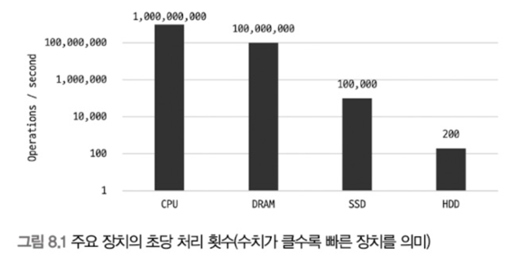
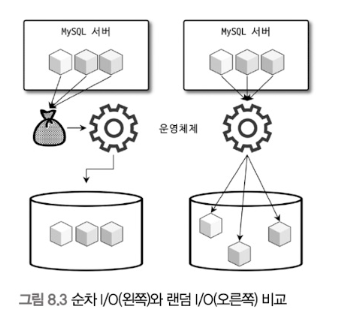
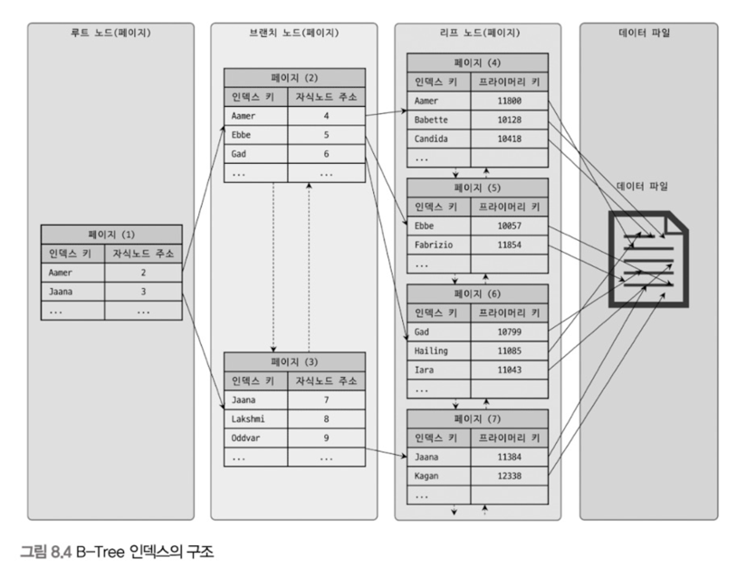
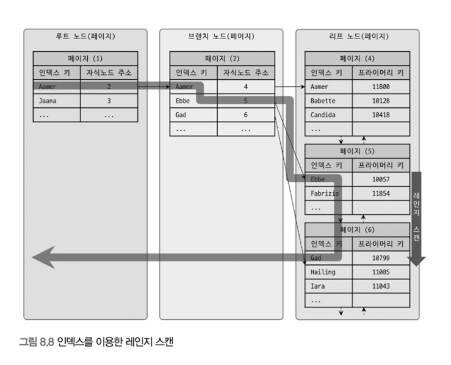
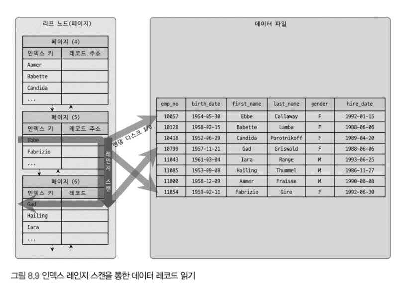

# 8. 인덱스

## 8.1 디스크읽기방식

인덱스에 들어가기 앞 `랜덤I/O`와 `순차(시퀀셜)I/O`에 대해 알아보는게 좋다. (추후..) 
또한 DB나 쿼리 튜닝은 어떤 디스크의 I/O를 줄이느냐가 관건일 때가 많다.

### HDD와 SSD

> 컴퓨터에서 CPU나 메모리 같은 주요 장치는 대부분 전자식 장치지만, 하드 디스크 드라이브 (HDD)와 같은 보조 기억 장치는 기계식 장치이다. 
> 그래서 DB 서버에서는 항상 디스크 장치가 병목이 된다. 
> 이러한 병목을 해결하기 위해서 기계식 HDD를 대체하여 전자식 저장 매체인 SSD를 사용하기도 한다. 

#### SSD의 특정

- 기존 HDD에서 데이터 저장용 플래터를 제거하고 그 대신 **플래시 메모리**를 장착하고 있다.
    - 그래서 디스크 원판을 기계적으로 회전시킬 필요가 없으므로 아주 빨리 데이터를 읽고 쓸 수 있다.
- 플래시 메모리는 전원이 공급되지 않아도 데이터가 삭제되지 않는다.
- 컴퓨터 메모리 (D-Ram)보다는 느리지만 기계식 HDD보다는 훨씬 빠르다.
  

디스크의 헤더를 움직이지 않고 한 번에 많은 데이터를 읽는 순차 I/O에서는 SSD가 HDD 보다 조금 빠르거나 엇비슷한 성능을 보이기도 한다. 
하지만 SSD의 장점은 기존 HDD보다 **랜덤I/O 성능이 월등히 뛰어나다는 것**이다. 
DB 서버에서 순차I/O 작업은 그다지 비중이 크지 않고, 랜덤 I/O를 통해 작은 데이터를 읽고 쓰는 작업이 대부분이므로 SSD의 장점은 DBMS용 스토리지에 최적이라고 볼 수 있다.

### 랜덤I/O & 순차I/O

> 랜덤 I/O라는 표현은 하드 디스크 드라이브의 플래터(원판)을 돌려서 읽어야 할 데이터가 저장된 위치로 디스크 헤더를 이동시킨 다음 데이터를 읽는 것을 의미한다.
> 사실 순차I/O 또한 이 작업 과정은 같다. 그렇다면 이 둘은 어떤 차이가 있을까?

> 순차 I/O는 3개의 페이지(3 X 16KB)를 디스크에 기록하기 위해 한 번 시스템 콜을 요청했지만, 랜덤I/O는 3개의 페이지를 디스크에 기록하기 위해 세 번 시스템 콜을 요청함.

- 디스크에 데이터를 읽고 쓰는데 걸리는 시간은 디스크 헤더를 움직여서 읽고 쓸 위치로 옮기는 단계에서 결정된다.
    - 결국 위 그림의 경우 순차I/O가 랜덤 I/O보다 3배 빠르다고 할 수 있다.
- 즉 디스크의 성능은 디스크 헤더의 위치 이동 없이 얼마나 많은 데이터를 한 번에 기록하느냐에 의해 결정 된다고 볼 수 있다.
- 그래서 **여러 번 쓰기 또는 읽기를 요청하는 랜덤 I/O 작업이 작업 부하가 훨씬 더 크다.**
- DB 대부분의 작업은 이러한 작은 데이터를 빈번히 읽고 쓰기 때문에 MySQL 서버에는 그룹 커밋이나 바이너리 로그 버퍼 또는 InnoDB 로그 버퍼 등의 기능이 내장돼 있다.
- 또한 SSD 드라이브에서도 랜덤 I/O는 여전히 순차I/O보다 전체 스로풋이 떨어진다.

사실 쿼리를 튜닝해서 랜덤I/O를 순차I/O로 바꿔서 실행할 방법은 그다지 많지 않다. 
일반적으로 쿼리를 튜닝하는 것은 랜덤 I/O 자체를 줄여주는 것이 목적이라고 할 수 있다.

> ### 참고
> - 인덱스 레인지 스캔은 데이터를 읽기 위해 주로 랜덤I/O를 사용한다.
> - 풀 테이블 스캔은 순차 I/O를 사용한다.
>
> 그래서 큰 테이블의 레코드 대부분을 읽는 작업에서는 인덱스를 사용하지 않고 풀 테이블 스캔을 사용하도록 유도할 때도 있다. 
> 이는 순차 I/O가 랜덤 I/O보다 훨씬 빨리 많은 레코드를 읽어올 수 있기 때문인데, 이런 형태는 OLTP(OnLine Transaction Processing) 성격의 웹 서비스보다는 데이터
> 웨어하우스나 통계 작업에서 자주 사용된다.

## 8.2 인덱스

> DB 테이블의 모든 데이터를 검색해서 원하는 결과를 가져오려면 시간이 오래 걸린다. 
> 그래서 컬럼의 값과 해당 레코드가 저장된 주소를 키와 값의(key-value) 쌍으로 삼아 인덱스를 만들어 두는 것이다.
> 이 때 해당 데이터로 더욱 빠르게 찾아가기 위해 컬럼의 값을 주어진 순서로 미리 정렬해서 보관한다.

#### 자료구조와 비교해보자.

- `SortedList`는 DBMS의 인덱스와 같은 구조이다.
    - 저장되는 값을 항상 정렬된 상태로 유지하는 자료구조이다.
    - 데이터가 저장될 때마다 항상 값을 정렬해야 하므로 저장하는 과정이 복잡하고 느리지만, 이미 정렬되어 있어 아주 빨리 원하는 값을 가져올 수 있다.
- `ArrayList`는 데이터 파일과 같은 자료구조를 사용한다.
    - 값을 저장되는 순서 그대로 유지하는 자료 구조다.

결론적으로 DBMS에서 **인덱스는 데이터의 저장(INSERT, UPDATE, DELETE) 성능을 희생하고 그 대신 데이터의 읽기 속도를 높이는 기능이다.** 
`SELECT` 쿼리 문장의 `WHERE` 조건절에 사용되는 컬럼이라고 해서 전부 인덱스로 생성하면 데이터 저장 성능이 떨어지고 인덱스의 크기가 비대해져 오히려 역효과만 불러올 수 있다.

인덱스는 데이터를 관리하는 방식(알고리즘)과 중복 값의 허용 여부 등에 따라 여러 가지로 나눠볼 수 있다. 
인덱스를 역할별로 구분해 본다면 프라이머리 키(PK)와 보조키(세컨더리 인덱스)로 구분할 수 있다.

> - 프라이머리 키는 이미 잘 아는 것처럼 그 레코드를 대표하는 컬럼의 값으로 만들어진 인덱스를 의미한다. 이 컬럼(때로는 컬럼의 조합)은 테이블에서 해당 레코드를 식별할 수 있는 기준값이 되기 때문에 우리는 이를
    식별자라고도 부른다.
    >

- 프라이머리 키는 NULL 값을 허용하지 않으며 중복을 허용하지 않는 것이 특징이다.

> - 프라이머리 키를 제외한 나머지 모든 인덱스는 세컨더리 인덱스로 분류한다.
    >

- 유니크 인덱스는 프라이머리 키와 성격이 비슷하고 프라이머리 키를 대체해서 사용할 수도 있다고 해서 대체 키라고도 하는데, 별도로 분류하기도 하고 그냥 세컨더리 인덱스로 분류하기도 한다.

또한 데이터의 중복 허용 여부로 분류하면 유니크 인덱스와 유니크하지 않은 인덱스로 구분할 수 있다.  
인덱스가 유니크한지 아닌지는 단순히 같은 값이 1개만 존재하는지 1개 이상 존재할 수 있는지를 의미하지만, 실제 DBMS의 쿼리를 실행해야 하는 옵티마이저에게는 상당히 중요한 문제가 된다. 
유니크 인덱스에 대한 동등 조건(Equal, =)으로 검색한다는 것은 항상 1건의 레코드만 찾으면 더 찾지 않아도 된다는 것을 옵티마이저에게 알려주는 효과를 낸다.

## 8.3 B-Tree 인덱스

> B-Tree는 데이터베이스의 인덱싱 알고리즘 가운데 가장 일반적으로 사용되고, 가장 먼저 도입된 알고리즘이다. 
> 하지만 아직도 가장 범용적인 목적으로 사용되는 인덱스 알고리즘이다.

B-Tree의 구조를 설명한 그림 때문인지 많은 사람들이 B-Tree의 "B"가 바이너리(이진) 트리라고 잘못 생각한다. 
하지만 B-Tree의 "B"는 "Binary(이진)"의 약자가 아니라 "Balanced"를 의미한다는 점에 주의하자. 
또한 B-Tree는 칼럼의 원래 값을 변형시키지 않고 인덱스 구조체 내에서는 항상 정렬된 상태로 유지한다. 그래서 전문 검색과 같은 특수한 요건이 아닌 경우, 대부분 인덱스는 거의 B-Tree를 사용할 정도로
일반적인 용도에 적합한 알고리즘이다.

### 구조 및 특성

- 트리 구조의 최상위에 하나의 `루트 노드`가 존재한다.
- 그 하위에 자식 노드가 붙어 있는 형태이다.
- 트리 구조중 가장 하위에 있는 노드를 `리프 노드` 라고 한다.
- 루트 노드도 아니고 리프 노드도 아닌 중간의 노드를 `브랜치 노드`라고 한다.

DB에서 인덱스와 실제 데이터가 저장된 데이터는 따로 관리되는데, 인덱스의 **리프 노드는 항상 실제 데이터 레코드를 찾아가기 위한 주솟값을 가지고 있다.**  

### 인덱스 키 추가

B-Tree에 저장될 때는 저장될 키 값을 이용해 B-Tree상의 적절한 위치를 검색해야 한다. 
저장될 위치가 결정되면 레코드의 키 값과 대상 레코드의 주소 정보를 B-Tree의 리프 노드에 저장한다. 리프 노드가 꽉 차서 더는 저장할 수 없을 때는 리프 노드가 분리돼야 하는데, 
이는 상위 브랜치 노드까지 처리의 범위가 넓어진다. 이러한 작업 탓에 B-Tree는 **상대적으로 쓰기 작업에 비용이 많이 드는 것**이다.

### 인덱스 키 삭제

간단하다. 해당 키 값이 저장된 B-Tree의 리프 노드를 찾아서 그냥 삭제 마크만 하면 작업 완료이다. 
이렇게 삭제 마킹된 인덱스 키 공간은 계쏙 방치하거나 재활용할 수 있다.  
**인덱스 키 삭제로 인한 마킹 작업 또한 디스크 쓰기가 필요하므로 이 작업 역시 디스크 I/O가 필요한 작업이다.**

### 인덱스 키 변경

인덱스의 키 값은 그 값에 따라 저장될 리프 노드 위치가 결정되므로 B-Tree의 키 값이 변경되는 경우에는 단순히 인덱스 상의 키 값을 변경하는 것은 불가능하다. 
B-Tree의 키 값 변경은 먼저 해당 키 값을 삭제한 후, 다시 새로운 키 값을 추가하는 형태로 처리된다. 
**결국 인덱스 키 값을 변경하는 작업은 기존 인덱스 키 값을 삭제한 후 새로운 인덱스 키 값을 추가하는 작업으로 처리되고 InnoDB 스토리지 엔진을 사용하는 테이블에 대해서는 이 작업 모두 체인지 버퍼를 활용해
지연 처리 될 수 있다.**

### 인덱스 키 검색

INSERT,UPDATE,DELETE 작업에 따르는 추가비용을 감당하면서도 인덱스를 구축하는 이유는 바로 **빠른 검색을 위해서다.** 
**인덱스 트리 탐색**은 SELECT에서만 사용하는 것이 아니라 UPDATE나 DELETE를 처리하기 위해 항상 해당 레코드를 먼저 검색하야할 경우에도 사용된다.

> 인덱스를 구성하는 키 값의 뒷 부분만 검색하는 용도로는 인덱스를 사용할 수 없다. 
> 인ㄷ게스를 이용한 검색에서 중요한 사실은, 인덱스의 키 값에 변형이 가해진 후 비교되는 경우에는 절대 B-Tree의 빠른 검색 기능을 사용할 수 없다는 것이다. 
> - 이미 변형된 값은 B-Tree 인덱스에 존재하는 값이 아니다.
> - 따라서 함수나 연산을 수행한 결과로 정렬한다거나 검색하는 작업은 B-Tree의 장점을 이용할 수 없다.

#### InnoDB와 스트리지 엔진과 인덱스

InnoDB 테이블에서 지원하는 레코드 잠금이나 넥스트 키 락(갭락)이 검색을 수행한 인덱스를 잠근 후 테이블의 레코드를 잠그는 방식으로 구현돼 있다.

- 따라서 UPDATE나 DELETE 문장이 실행될 때 **테이블에 적절히 사용할 수 있는 인덱스가 없으면** 불필요하게 많은 레코드를 잠근다.
- 심지어 모든 테이블의 모든 레코드를 잠글 수도 있다!!
- **InnoDB 스토리지 엔진에서는 그만큼 인덱스의 설계가 중요하고 많은 부분에 영향을 미친다.**

### 읽어야 하는 레코드의 건수

인덱스를 통해 테이블의 레코드를 읽는 것은 인덱스를 거치지 않고 바로 테이블의 레코드를 읽는 것보다 높은 비용이 드는 작업이다.
> 테이블에 레코드가 100만 건이 저장돼 있는데, 그중에서 50만 건을 읽어야하는 쿼리가 있다고 하자.
> - 이 작업은 전체 테이블을 모두 읽고, 필요없는 50만 건을 버리는게 나을까? vs 인덱스를 통해 필요한 50만 건만 읽어 오는 것이 효율적일까?

일반적인 DBMS의 옵티마이저에서는 인덱스를 통해 레코드 1건을 읽는 것이 테이블에서 직업 레코드 1건을 읽는 것보다 4~5배 정도 비용이 더 많이 드는 작업인 것으로 예측한다. 
즉 인덱스를 통해 읽어야 할 레코드의 건수(물론 옵티마이저가 판단한 예상 건수)가 전체 테이블 레코드의 20~25%를 넘어서면 인덱스를 이용하지 않고, 테이블을 모두 직접 읽어서 필요한 레코드만 가려내는 방식으로
처리하는 것이 효율적이다. 

이렇게 많은 레코드(전체 레코드의 20~25%)를 읽을 때는 강제로 인덱스를 사용하도록 힌트를 추가해도, 성능상 얻을 수 있는 이점이 없다. 
물론 이러한 작업은 MySQL 옵티마이저가 기본적으로 힌트를 무시하고 테이블을 직접 읽는 방식으로 처리하겠지만, 기본적으로 알고 있어야 할 사항이다.

---

## B-Tree 인덱스를 통한 데이터 읽기

어떤 경우에 인덱스를 사용하게 유도할지, 또는 사용하지 못하게 할지 판단하려면 MySQL(더 정확히는 각 스토리지 엔진)이 어떻게 인덱스를 이용해서 실제 레코드를 읽어 내는지 알아야한다. 
MySQL이 인덱스를 이용하는 대표적인 3가지 방법을 살펴보자.

### 1. 인덱스 레인지 스캔

인덱스 레인지 스캔은 검색해야 할 인덱스의 범위가 결정됐을 때 사용하는 방식이다. 
일단 시작해야 할 위치를 찾으면 그때부터는 리프 노드의 레코드만 순서대로 읽으면 된다. 이처럼 차례대로 쭉 읽는 것을 스캔이라고 표현한다. 
**중요한 것은 어떤 방식으로 스캔하든 관계없이, 해당 인덱스를 구성하는 컬럼의 정순 또는 역순으로 정렬된 상태로 레코드를 가져온다는 것**이다. 
이는 별도의 별도의 정렬 과정이 수반되는 것이 아니라 인덱스 자체의 정렬 특성 때문에 자동으로 그렇게 된다.  

또 한 가지 중요한 것은 **인덱스의 리프 노드에서 검색 조건에 일치하는 건들은 데이터 파일에서 레코드를 읽어오는 과정이 필요하다는 것**이다. 
이때 리프 노드에 저장된 레코드 주소로 데이터 파일의 레코드를 읽어오는데, 레코드 한 건 한건 단위로 랜덤I/O가 한번씩 일어난다. 
그래서 인덱스를 통해 데이터 레코드를 읽는 작업은 비용이 많이 드는 작업으로 분류된다. 그리고 **인덱스를 통해 읽어야 할 데이터 레코드가 20~15%를 넘으면 인덱스를 통한 읽기보다 테이블의 데이터를 직접읽는 것이
더 효율적인 처리 방식이 된다.**

> 1. 인덱스에서 조건을 만족하는 값이 저장된 위치를 찾는다. 이 과정을 인덱스 탐색(Index seek)이라고 한다.
> 2. 1번에서 탐색된 위치부터 필요한 만큼 인덱스를 차례대로 쭉 읽는다. 이 과정을 인덱스 스캔 이라고 한다. (1,2번 합쳐서 인덱스 스캔으로 통칭하기도 한다.)
> 3. 2번에서 읽어 들인 인덱스 키와 레코드 주소를 이용해 레코드가 저장된 페이지를 가져오고, 최종 레코드를 읽어 온다.

쿼리가 필요로 하는 데이터에 따라 3번 과정은 필요하지 않을 수도 있는데, 이를 **커버링 인덱스**라고 한다. 
커버링 인덱스로 처리되는 쿼리는 디스크의 레코드를 읽지 않아도 되기 때문에 랜덤 읽기가 상당히 줄어들고 성능은 그만큼 빨라진다.

### 인덱스 풀 스캔
인덱스 레인지 스캔과는 달리 **인덱스의 처음부터 끝까지 모두 읽는 방식**을 인덱스 풀 스캔이라고 한다. 
대표적으로 쿼리의 조건절에 사용된 컬럼이 인덱스의 첫 번째 컬럼이 아닌 경우 인덱스 풀 스캔 방식이 사용된다.
- 예를 들어, 인덱스는 (A,B,C) 컬럼의 순서로 만들어져 있지만 쿼리의 조건절은 B컬럼이나C 컬럼으로 검색하는 경우

> 일반적으로 인덱스의 크기는 테이블의 크기보다 작으므로 직접 테이블을 처음부터 끝까지 읽는 것보다는 인덱스만 읽는 것이 효율적이다. 
> 쿼리가 인덱스에 명시된 컬럼만으로 조건을 처리할 수 있는 경우 주로 이 방식이 사용된다. 
> 하지만, 인덱스뿐만 아니라 데이터 레코드까지 모두 읽어야 한다면 절대 이 방식으로 처리되지 않는다.

### 루스 인덱스 스캔
루스 인덱스 스캔은 '루스(Loose)' 말 그대로 느슨하게 또는 듬성듬성하게 인덱스를 읽는 것을 의미한다. 
앞에서 소개한 두 가지 접근 방법 (`인덱스 레인지 스캔` / `인덱스 풀 스캔`)은 루스 인덱스 스캔과는 상반된 `타이트 인덱스 스캔`으로 분류한다. 
