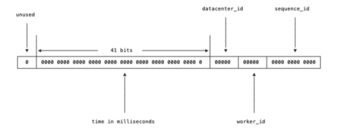

# 제 7장. 분산 시스템을 위한 유일 ID 생성기 설계

> 이번 장에서는 분산 시스템에서 사용될 유일 ID 생성기를 설계해 볼 것이다. 
> 아마, "auto increment 속성이 설정된 관계형 데이터베이스의 기본 키를 쓰면 되지 않을까? 라고 생각할 수 있다. 
> 하지만 분산 환경에서 이 접근법을 통하지 않을 것이다. 데이터베이스 서버 1대로는 그 요구를 충족하지 못할 뿐더러, 여러 데이터베이스 서버를 쓰는 경우에는 지연시간을 낮추기가 무척이나 힘들기 때문이다.

## 1단계. 문제 이해 및 설계 범위 확정

시스템 설계 면접 문제를 푸는 첫 단계는 적절한 질문을 통해 모호함을 없애고 설계 방향을 정하는 것이다. 
아래는 면접관과 지원자 사이에 오갈 수 있는 질문과 답변의 예시이다.

- 지원자 : ID 는 어떠한 특성을 갖는가?
    - 면접관 : ID 는 유일해야 하고, 정렬 가능해야 한다.
- 지원자 : 새로운 레코드에 붙일 ID 는 항상 1만큼 큰 값이어야 하는가?
    - 면접관 : ID 의 값은 시간이 흐름에 따라 커질 테지만, 언제나 1씩 증가한다고 할 수는 없다. 다만 확실한 것은, 아침에 만든 ID 보다는 저녁에 만든 ID 가 큰 값을 갖는다는 특징이다.
- 지원자 : ID 는 숫자로만 구성되는가?
    - 면접과 : 그렇다.
- 지원자 : 시스템 규모는 어느 정도인가?
    - 면접관 : 초당 10,000 ID 를 생성할 수 있어야 한다.

질문을 할 때는 요구사항을 이해하고 모호함을 해소하는 데 초점을 맞추어야 한다. 
위와 같은 질문을 통해, 이번 문제에 대한 답안이 만족해야 할 요구사항을 정리해보면 아래와 같다.

> - ID 는 유일해야 한다.
>- ID 는 숫자로만 구성되어야 한다.
> - ID 는 64비트로 표현될 수 있는 값이어야 한다.
> - ID 는 발급 날짜에 따라 정렬 가능해야 한다.
> - 초당 10,000개의 ID 를 만들 수 있어야 한다.

## 2단계. 개략적 설계안 제시 및 동의 구하기

분산 시스템에서 유일성이 보장되는 ID 를 만드는 방법에는 여러 가지가 있다. 우리는 다음과 같은 선택지를 살펴볼 것이다.

- 다중 마스터 복제
- UUID
- 티켓 서버
- 트위터 스노플레이크 접근법
- 각각의 동작 원리와 장단점을 살펴보도록 하자.

### 설계안1 - 다중 마스터 복제 (Multi Master Replication)

다중 데이터베이스 서버 환경에서 auto increment 를 사용하는 방법이다. 단, auto increment 의 증가량이 1이 아니라 k인 점이 일반적인 방식과 차이가 있다. k는 총 데이터베이스의 서버
대수이다.

예를들어 데이터베이스가 총 4대가 있다고 해보자. 1번 데이터베이스는 ID 값이 1, 5, 9, 13, ... 으로, 2번 데이터베이스는 2, 6, 10, 14, ... 으로, 3번 데이터베이스는 3, 7, 11,
15, ... 처럼 증가하도록 설계하면 된다.

이 방법은 다중 시스템에서 유일한 ID 를 생성할 수 있으며, 데이터베이스 수를 늘려 초당 생성할 수 있는 ID 수를 늘릴 수 있다. 하지만, 아래의 단점이 존재한다.

**우선 확장성에 불리하다.** 데이터베이스 수가 늘거나 줄게되면 중간에 k 값이 변경되는데, 이에 대응하는 것이 어렵다. 
이미 과거의 k 값을 기준으로 생성된 ID 와 중간부터 생성될 ID 를 생각하면 확장성이 쉽지 않아 보인다. 
이런 특징으로 여러 데이터 센터에 걸쳐 규모를 확장하기 어려울 것이다.  
즉, 데이터베이스 수가 끝까지 최초 k 로 고정된 상황에서 쓰기 적합해보이는데, 이는 데이터베이스 수가 무조건 항상 고정되어야 한다는
특징이 보장되어야 하므로 확장성에 불리하다.

두번째로는 **시간 흐름에 맞게 커짐을 보장하지 않는다는 점이다.**  
요구사항 중 "ID 는 발급 날짜에 따라 정렬 가능해야 한다" 가 있었다. 그런데, 이 방법에서는 2번 ID가 1번 ID보다 먼저 생성될 수 있다. 
1번 데이터베이스보다 2번 데이터베이스에서 먼저 요청이 실행되면 발생하는 문제이다. 즉, ID가 시간적 순서에 따라 정렬되지 않으므로 요구사항을 위반하게 된다.

### 설계안2 - UUID

UUI는 정보를 유일허게 식별하기 위한 128bit 짜리 16진수이다. 
UUID 는 충돌 가능성이 아예 0% 라고는 못하지만, 사실상 충돌할 일이 없다고 보는것이 맞다. 만약 UUID 가 충돌 가능성이 50%가 되기 위해선, 100년동안 초당 10억개의 ID 를 생성해내면 50% 가
된다고 한다. 즉, UUID 는 사실상 충돌할 일이 없다.

이러한 특징으로 보아, UUID 를 유일 키로 사용하명 어떨까? 서버간 조율 과정도 필요 없으므로 동기화가 필요 없고, 각 서버는 자기가 알아서 쓸 ID 를 만드는 구조이므로 규모 확장이 쉽다.

하지만, ID 는 128로 길다. 
앞선 요구사항을 보면 최대 64비트로 제한된다. 또한 숫자로만 구성되어 있지도 않으며, 발급 날짜에 따라 정렬이 불가능하다. 
따라서 문제를 해결할 수 없다. 몰론 이러한 요구사항 및 제약사항이 없었더라면 UUID 는 꽤 괜찮은 선택지가 되었을 것이다.

### 설계안3 - 티켓 서버

아예 유일한 키를 생성하는 서버를 별도로 분리하는건 어떠할까? 플리커(Flicker) 라는 회사는 분산 기본 키(Distributed Primary Key)를 생성하기 위한 방법으로 이를 택했다고 한다.

웹 서버 여러대가 auto increment로 ID 를 생성하는 티켓 서버를 중앙 집중형으로 하나만 사용하는 것이다. 
이 방법은 유일성이 보장되고, 숫자로만 구성된, 64비트로 표현 가능한, 발급 날짜에 따라 정렬 가능한 ID 를 생성할 수 있다. 
성능만 갖춰진다면 초당 10,000개의 ID 를 생성할 수 있을 것이다. 구현도 굉장히 쉬울 것이다.

하지만, 이 방법은 **SPOF(Single Point Of Failure)** 가 된다. 티컷 서버를 중앙 집중형으로 단 1대만 사용한다. 
따라서 티켓 서버 1대에서 장애가 발생하면 모든 서비스를 이용할 수 없게 된다.
이를 해결한다고 티켓 서버를 다중화해버리면, 애당초 해결하고자 했던 동기화 이슈가 다시 발생한다.

### 설계안4 - 트위터 스노우 플레이크 접근법

앞선 방법들은 모두 요구사항을 충족하지 못한다.  
트위터는 이 문제를 해결하기 위해 스노우플레이크라고 부르는 독자적인 ID 생성 기법을 만들어 해결했다. 

ID는 총 5개의 절(section) 으로 나뉜다. 절 순서대로 간략히 설명해보자면 아래와 같다.

- (1) 사인(sign) 비트 : 1비트를 할당한다.-  현재는 사용되지 않는다. 나중을 위해 확보해둔 비트로, 임수롸 양수를 구변하는데 사용할 수 있다.
- (2) 타임스탬프(timestamp) : 41비트를 할당한다. Epoch Time 이후로 몇 밀리세컨드가 경과했는지 나타낸다. 41비트이므로 최대 69년의 시간을 표현할 수 있다.
  - 일반적으로 Epoch Time은 1970년 01월 01일 00시 00분 00초를 뜻한다.
  - 그런데 트위터는 더 오래 이 ID체계를 사용하기 위해 Epoch Time 으로 기원시각(297,616,116,518)으로 보정해여 사용한다고 한다.
- (3) 데이터센터 ID : 5비트를 할당한다. 2^5, 즉 32개의 데이터 센터를 사용할 수 있다.
- (4) 서버 ID : 5비트를 할당한다. 2^5, 즉 데이터 센터별 32개의 서버를 사용할 수 있다.
- (5) 일련번호 : 12비트를 할당한다. 각 서버는 ID 를 생성할 때 마다 이 일련번호를 1씩 증가시킨다. 이 값은 1ms 가 경과할 때 마다 0으로 초기화된다.

이는 요구사항을 모두 충족할까? 
우선, ID에 타임 스탬프 값을 넣어두기 때문에 시간순으로 정렬이 가능하다. 또한 데이터 센터 ID 와 서버 ID 를 사용하여 서로 다른 서버에서 같은 시각에 생성한 ID 도 충돌이 발생하지 않는다. 
또한 내부적으로 일렵번호를 사용하여 같은 서버에서 생성한 ID 값 끼리도 충돌이 발생하지 않는다. 이 과정은 서버간 동기화가 필요 없기 때문에, 확장성 측면에서도 유리하다. ID 전체 길이도 딱
64비트라서 모든 요구사항을 만족한다.
