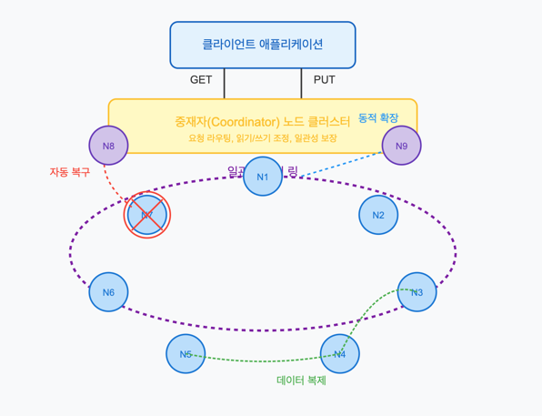
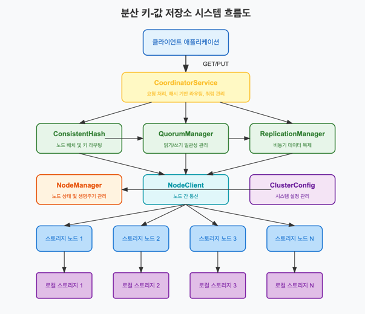

# 6. 분산 kev-value 저장소

## 프로젝트 시나리오
> **글로벌 SNS 플랫폼 사용자 세션 관리 시스템**  
> 프로젝트는 전 세계 약 5억 명의 사용자를 보유한 대형 SNS 플랫폼이다. 
> 이 플랫폼은 실시간 사용자 세션 관리를 위한 고성능, 고가용성 키-값 저장소가 필요하다.

## 데이터 규모 및 요구사항:
- 동시 접속 사용자: 약 5,000만 명
- 사용자당 세션 데이터: 평균 2KB
- 총 메모리 요구량: ~100GB
- 초당 읽기 요청: 최대 100만 QPS
- 초당 쓰기 요청: 최대 20만 QPS
- 최대 허용 응답 시간: 10ms
- 가용성 요구사항: 99.999% (연간 다운타임 5분 이내)

## 시스템 아키텍처

## 시스템 흐름도

## 시스템 핵심 컴포넌트 및 흐름 설명

### 1. 클라이언트 요청 처리 흐름

#### GET 작업 흐름 (데이터 읽기)
1. **클라이언트** → **CoordinatorService**:
   - 클라이언트는 `KVStoreClient` 인터페이스를 통해 `get(key)` 메서드를 호출합니다.

2. **CoordinatorService** → **ConsistentHash**:
   - 키에 대한 담당 노드를 찾기 위해 `getNodesForKey(key, replicationFactor)` 호출
   - 일관된 해시 알고리즘으로 키를 저장하는 노드와 복제본을 가진 노드 목록을 반환

3. **CoordinatorService** → **QuorumManager**:
   - `readWithQuorum(key, targetNodes)` 호출하여 쿼럼 읽기 수행

4. **QuorumManager** → **NodeClient**:
   - 모든 대상 노드에 병렬로 읽기 요청 전송
   - 읽기 쿼럼(R) 이상의 노드로부터 응답 대기
   - 버전이 가장 높은 값 선택
   - 버전 불일치가 발견되면 읽기 수리(Read Repair) 수행

5. **NodeClient** → **스토리지 노드**:
   - HTTP/REST 또는 RPC를 통해 스토리지 노드와 통신

6. **스토리지 노드** → **로컬 스토리지**:
   - 각 노드의 로컬 스토리지에서 키에 대한 값 조회

7. **응답 반환**:
   - 최신 버전의 값을 클라이언트에 반환

#### PUT 작업 흐름 (데이터 쓰기)
1. **클라이언트** → **CoordinatorService**:
   - 클라이언트는 `KVStoreClient` 인터페이스를 통해 `put(key, value, ttl)` 메서드를 호출

2. **CoordinatorService** → **ConsistentHash**:
   - 키에 대한 담당 노드를 찾기 위해 `getNodesForKey(key, replicationFactor)` 호출
   - 일관된 해시 알고리즘으로 키를 저장할 노드 목록을 반환

3. **CoordinatorService** → **QuorumManager**:
   - `writeWithQuorum(key, value, ttlSeconds, targetNodes)` 호출하여 쿼럼 쓰기 수행

4. **QuorumManager** → **NodeClient**:
   - 최신 버전 번호 결정을 위해 기존 값 조회
   - 새 버전 번호로 데이터 업데이트
   - 모든 대상 노드에 병렬로 쓰기 요청 전송
   - 쓰기 쿼럼(W) 이상의 노드로부터 성공 응답 대기

5. **CoordinatorService** → **ReplicationManager**:
   - 쿼럼 쓰기 성공 후 `replicateAsync(key, value, ttlSeconds, updatedNodes)` 호출하여 비동기 복제 시작
   - 쿼럼에 포함되지 않은 나머지 노드에 비동기적으로 데이터 복제

6. **응답 반환**:
   - 쿼럼 쓰기 성공 여부를 클라이언트에 반환

### 2. 노드 관리 및 장애 처리 흐름

#### 노드 추가/제거 흐름
1. **NodeManager**:
   - 새 노드가 클러스터에 참여하면 `addNode(node)` 메서드로 노드 등록
   - 노드가 클러스터를 떠나면 `removeNode(nodeId)` 메서드로 노드 제거

2. **ConsistentHash**:
   - 노드 추가/제거 시 해시 링 업데이트
   - 가상 노드 기법으로 데이터 분산 균형 유지

3. **ReplicationManager**:
   - 새 노드 추가 시 `rebalanceForNode(nodeId)` 메서드로 데이터 재조정
   - 노드 제거 시 `migrateDataFromNode(nodeId)` 메서드로 데이터 마이그레이션

#### 장애 감지 및 복구 흐름
1. **NodeManager**:
   - 주기적으로 `checkNodeHealth()` 메서드 실행하여 노드 건강 상태 확인
   - 하트비트 응답이 없는 노드는 비활성 상태로 표시

2. **NodeClient**:
   - 노드와의 통신 오류 발생 시 재시도 메커니즘 활성화
   - 지속적인 오류 시 예외 발생, 상위 계층에서 처리

3. **ReplicationManager**:
   - 주기적으로 `retryFailedReplications()` 메서드 실행하여 실패한 복제 작업 재시도
   - 노드 복구 시 데이터 동기화

### 3. 주요 데이터 구조 및 모델

1. **키-값 페어**:
   - `VersionedValue`: 버전 정보를 포함한 값 객체
   - 값, 버전 번호, 생성 시간, 수정 시간, TTL 정보 포함

2. **노드 정보**:
   - `Node`: 클러스터의 노드를 표현하는 객체
   - 노드 ID, 호스트 주소, 역할, 상태, 메타데이터 포함

3. **복제 작업**:
   - `ReplicationTask`: 복제 작업을 표현하는 객체
   - 작업 ID, 키, 값, TTL, 대상 노드, 생성 시간, 시도 횟수 등 포함

4. **요청/응답 모델**:
   - `StorageRequest`: 스토리지 요청 모델
   - `StorageResponse`: 스토리지 응답 모델

## 주요 설계 원칙 및 메커니즘

### 1. 일관성 보장 메커니즘
- **쿼럼 기반 읽기/쓰기**:
  - W + R > N 조건을 통해 강한 일관성 보장 (W: 쓰기 쿼럼, R: 읽기 쿼럼, N: 복제 인수)
  - 기본 설정: N=3, W=2, R=2

- **버전 관리**:
  - 모든 데이터에 버전 번호 부여
  - 버전 충돌 시 가장 높은 버전 선택

- **읽기 수리(Read Repair)**:
  - 읽기 작업 중 오래된 데이터 발견 시 자동 업데이트

### 2. 데이터 분산 메커니즘
- **일관된 해싱(Consistent Hashing)**:
  - 노드 추가/제거 시 데이터 재분배 최소화
  - 가상 노드 사용으로 데이터 균등 분포

- **데이터 파티셔닝**:
  - 키를 기준으로 파티셔닝하여 수평적 확장 가능

### 3. 고가용성 메커니즘
- **다중 복제(Replication)**:
  - 모든 데이터는 여러 노드에 복제
  - 일부 노드 장애 시에도 서비스 지속

- **자동 복구**:
  - 장애 감지 및 자동 복구 메커니즘
  - 실패한 복제 작업 재시도

### 4. 확장성 메커니즘
- **수평적 확장**:
  - 새 노드 추가로 쉽게 시스템 확장 가능
  - 데이터 균형 재조정

- **비동기 복제**:
  - 성능을 위한 비동기 복제 메커니즘
  - 쿼럼 완료 후 나머지 노드에 비동기적 복제

## 실제 규모 확장 시나리오

현재 시스템에서 데이터 양이 급격히 증가하여 확장이 필요한 상황을 가정해보겠습니다:

### 1. 초기 상태
- 5개 노드, 각 500GB 저장공간
- 총 2.5TB 데이터 저장 가능
- 현재 2TB 데이터 사용 중 (80% 사용률)

### 2. 확장 단계
1. **용량 계획**:
   - 6개월 내 3TB 추가 데이터 예상
   - 총 필요 용량: 5TB, 현재 가용 용량: 2.5TB
   - 추가 필요 용량: 2.5TB (안전 마진 포함)

2. **노드 추가**:
   - 각 500GB 저장공간을 가진 5개 노드 추가
   - 시스템 총 노드 수: 10개
   - 총 저장 공간: 5TB

3. **데이터 재조정**:
   - 새 노드가 추가될 때마다 일관된 해시 링 업데이트
   - 일부 키가 새 노드로 자동 재할당
   - 데이터 마이그레이션은 백그라운드에서 점진적으로 진행
   - 이 과정에서 시스템은 계속 작동 유지

4. **모니터링 및 튜닝**:
   - 노드별 데이터 분포 모니터링
   - 핫스팟 발생 시 가상 노드 수 조정
   - 성능 병목 발견 시 노드별 하드웨어 리소스 조정

### 3. 확장 후 상태
- 10개 노드, 총 5TB 저장공간
- 데이터 사용률: 약 40%
- 모든 노드에 데이터가 균등하게 분산
- 충분한 성장 여유 공간 확보

이 시나리오는 분산 키-값 저장소의 주요 강점인 수평적 확장성을 잘 보여준다. 
일관된 해싱 메커니즘 덕분에 노드 추가만으로 시스템 용량을 확장할 수 있으며, 이 과정에서 애플리케이션 중단이나 전체 데이터 재배치 없이 점진적으로 진행된다.

이러한 설계와 흐름을 통해 분산 키-값 저장소는 데이터가 계속 증가하는 환경에서도 안정적이고 효율적인 성능을 유지할 수 있다.
