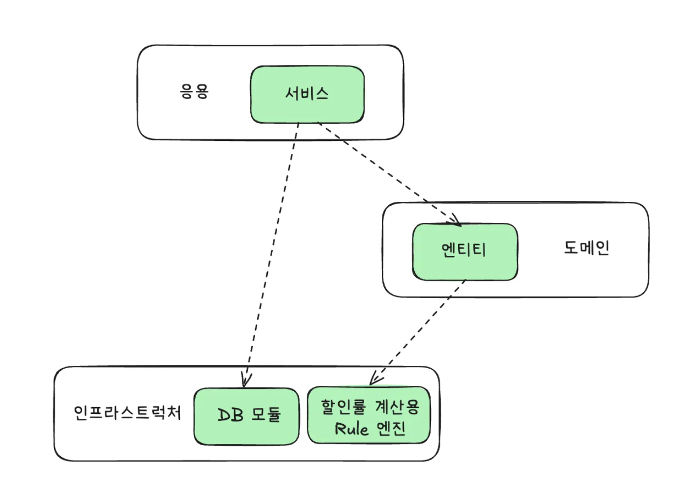
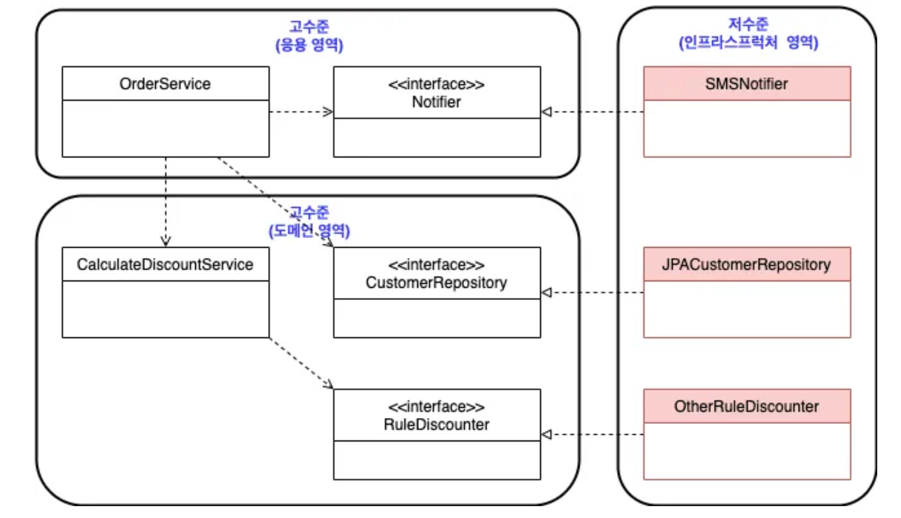

# 학습 목표

적어도 우리 회사 사람들끼리는 DDD에 관한 지식을 통합하자. 싱크를 맞추자! 결국 방법론!

베이스 서적 : [에릭 에반스 : DDD](https://product.kyobobook.co.kr/detail/S000001514402),  [최범균 : 도메인 주도 개발 시작하기](https://product.kyobobook.co.kr/detail/S000001810495)

# 2. DDD 2장 - 아키텍처 개요

- Keywords : `아키텍처`, `DIP`, `도메인 영역의 주요 구성요소`, `인프라스트럭처`, `모듈`

## 1. 네 개의 영역


- 표현 영역
    - HTTP 요청을 응용 영역이 필요로 하는 형식으로 변환해서 전달
    - 응용 영역의 응답을 HTTP 응답으로 변환하여 전송
- 응용 영역
    - 표현 영역을 통해 사용자의 요청을 전달받아 시스템이 사용자에게 제공해야 할 기능을 구현
    - 기능을 구현하기 위해 도메인 영역의 도메인 모델을 사용
    - **로직을 직접 수행하기보다는 도메인 모델에 로직 수행을 위임**
    
    ```java
    public class CancelOrderService {
        @Transactional
        public void cancelOrder(String orderId) {
        	Order order = findOrderById(orderId);
            if (order == null) throw new OrderNotFoundException(orderId);
            order.cancel(); // 도메인 모델에 로직 수행을 위임
        }
        ...
    }
    ```
    
    
- 도메인 영역
    - 도메인 모델을 구현
    - 도메인의 핵심 로직을 구현
- 인프라스트럭처
    - **구현 기술**에 대한것을 다루는 영역
    - RDBMS, SMTP, 서버, 카프카 연동 등 **논리적인 개념을 다루는 것이 아닌 실제 구현을 다룬다.**


도메인 영역, 응용 영역, 표현 영역은 구현 기술을 사용한 코드를 직접 만들지 않는다!<br>
대신 인프라스트럭처 영역에서 제공하는 기능을 사용해서 필요한 기능을 개발한다.

- Email 발송 → SMTP 연동 모듈을 이용해 메일 발송
- DB를 이용한 시스템 개발 → DBMS를 이용한 CRUD
- API 호출 → REST Client 사용을 통한 API 호출

## 2. 계층 구조 아키텍처


- 도메인의 복잡도에 따라 응용과 도메인 영역을 분리하기도, 통합하기도 하지만 전체적인 큰 아키텍처는 위의 계층 구조를 따른다.
- 계층 구조 특성상 상위 계층 → 하위 계층으로의 의존만 존재한다.
- 하위 계층에서 상위 계층을 의존하지는 않는다.

### 계층간 의존 관계

- 위 룰을 엄격하게 적용한다면 상위 계층은 바로 아래의 하위 계층에만 의존을 가져야한다.
- 하지만 구현의 편리함을 위해 계층 구조를 유연하게 적용하기도 한다.



### 문제점

계층 구조 아키텍처의 계층 의존 관계에는 응용 계층과 도메인 계층은 **상세한 구현 기술을 다루는 인프라스트럭처 계층에 종속**된다.<br>
예를 들어 도메인의 가격 계산 규칙이 있다고 하자.<br>
할인 금액을 계산하기 위해 외부의 할인률 계산용 Rule 엔진을 사용해서 계산 로직을 수행하는 인프라스트럭처 영역의 코드가 있다.

**DroolsRuleEngine.java (인프라스트럭처 계층)**

```java
public class DroolsRuleEngine {
	private KieContainer kContainer;
    
    public DroolsRuleEngine() { 
    	KieServices ks = KieServices.Factory.get();
        kContainer = ks.getKieClasspathContainer();
    }
    
    public void evaluate(String sessionName, List<?> facts) {
    	KieSession kSession = kContainer.newKieSession(sessionName);
        try {
        	facts.forEach(x -> kSession.insert(x));
            kSession.fireAllRules();
        } finally {
        	kSession.dispose();
        }
    }
}
```

**CalculateDiscountService.java (응용 계층)**

```java
public class CalculateDiscountService {
	private DroolsRuleEngine ruleEngine;

    public CalculateDiscountService() {
    	ruleEngine = new DroolsRuleEngine();
    }

    public Money calculateDiscount(List<OrderLine> orderLines, String customerId) {
    	Customer customer = findCustomer(customerId);

        MutableMoney money = new MutableMoney(0);
        List<?> facts = Arrays.asList(customer, money);
        facts.addAll(orderLines);
        ruleEngine.evaluate("discountCalculation", facts);
        return money.toImmutableMoney();
    }
}
```

- CalculateDiscountService의 `calculateDiscount` 메소드를 볼 경우 응용 계층에서 인프라스트럭처 계층의 DroolsRuleEngine을 이용하기 위해 일부 로직을 구현한 것을 볼 수 있다.
- 이것만으로 의존하지 않는다고 생각할 수 있지만, `discountCalculation`는 DroolsRuleEngine의 session 이름을 의미하며 session 이름이 변경될 경우 응용 계층의 코드 또한 변경해야 하는 **간접 의존이 발생**한다.

## 3. DIP (**Dependency Injection Principle)**


앞서 보여준 코드는 

1. 고객 정보를 구한다.
2. 할인율 룰을 이용해서 할인 금액을 구한다.

여기서 `CalculateDiscountService` 는 ‘가격 할인 계산’ 이라는 의미있는 단일 기능을 제공하는 모듈로 **고수준** 모듈이라고 부른다.

해당 기능을 구현하기 위해서 ‘고객 정보를 구하고’, ‘할인율 룰을 이용’ 하는 기능이 필요한데 이를 **저수준 모듈** 이라고 부른다.

[고수준,저수준 모듈이 헷갈린다면](https://velog.io/@jaeyumn/Java-DIP%EC%97%90-%EB%82%98%EC%98%A4%EB%8A%94-%EC%A0%80%EC%88%98%EC%A4%80-%EB%AA%A8%EB%93%88-%EA%B3%A0%EC%88%98%EC%A4%80-%EB%AA%A8%EB%93%88%EC%9D%98-%EC%9D%98%EB%AF%B8)

- 고수준 모듈 기능을 구현하기 위해 저수준 모듈 여러 개를 사용해야 한다.
- 하지만 고수준 모듈이 저수준 모듈을 사용할 경우 앞서 말한 **‘테스트 어려움’** 과 **‘기능 확장의 어려움’** 이라는 문제가 발생한다.

이러한 문제를 해결하기 위해 DIP라는 의존성 주입 원칙을 사용한다.

`CalculateDiscountService`은 사실 '가격 할인 계산'을 하는 모듈만 구현이 된다면 Drools를 사용할지 말지는 중요하지 않다.

**고객 정보 + 구매 정보에 룰을 적용해 할인 금액을 구한다.** 라는 것만 중요하기에 DIP를 통해 이러한 저수준 모듈에서 해야할 기능들을 추상화된 인터페이스를 만들어 관리한다.

```java
public interface RuleDiscounter {
	Money applyRules(Customer customer, List<OrderLine> orderLines);
}
////////////////////////////
public class CalculateDiscountService {
	private RuleDiscounter ruleDiscounter;

    public CalculateDiscountService(RuleDiscounter ruleDiscounter) {
    	this.ruleDiscounter = ruleDiscounter
    }

    public Money calculateDiscount(List<OrderLine> orderLines, String customerId) {
    	Customer customer = findCustomer(customerId);

        return ruleDiscounter.applyRules(customer, orderLines);
    }
}
```

```java
public class DroolsRuleEngine implements RuleDiscounter{
	private KieContainer kContainer;

    public DroolsRuleEngine() {
    	KieServices ks = KieServices.Factory.get();
        kContainer = ks.getKieClasspathContainer();
    }

    @Override
    public void applyRules(Customer customer, List<OrderLine> orderLines) {
    	KieSession kSession = kContainer.newKieSession("discountCalculation");
        try {
        	.. 코드 생략
            kSession.fireAllRules();
        } finally {
        	kSession.dispose();
        }
        return money.toImmutableMoney();
    }
}
```


- DIP를 적용하여 저수준 모듈이 고수준 모듈에 의존하게 되는 구조로 변경
- **인터페이스를 구현한 *DroolsRuleDiscounter* 는 고수준의 하위 기능인 *RuleDiscounter* 를 구현한 것이므로 저수준 모듈**에 속한다.
- **DIP 를 적용하면 위 그림처럼 저수준 모듈이 고수준 모듈의 의존**하게 된다.
- 이렇게 고수준 모듈이 저수준 모듈을 사용하려면 고수준 모듈이 저수준 모듈에 **의존**해야 하는데 반대로 **저수준 모듈이 고수준 모듈에 의존한다하여 의존 역전 원칙, DIP(Dependency Injection Principle)** 라고 부른다.
- **DIP 를 적용하면 다른 영역이 인프라스트럭처 영역에 의존할 때 발생하는 구현 교체와 테스트 어려움의 문제를 해소**할 수 있다.

### 3.1) DIP 주의사항

DIP 를 잘못 생각하면 단순히 인터페이스와 구현 클래스를 분리하는 정도로 이해할 수 있는데, **DIP의 핵심은 고수준 모듈이 저수준 모듈에 의존하지 않도록 하는 것**이다.

아래는 DIP 를 정상 적용한 예시와 잘못 적용한 예시이다.


- 여전히 고수준 모듈이 저수준 모듈에 의존하고 있다.
- RuleEngine 인터페이스를 **고수준 모듈인 도메인 관점이 아니라 룰 엔진 이라는 저수준 모듈 관점에서 도출**했기 때문이다.

***CalculateDiscountService* 입장에서 할인 금액을 구하기 위해 룰 엔진을 사용하던 다른 엔진을 사용하던지는 중요하지 않고, 오직 규칙에 따라 할인 금액을 계산한다는 것이 중요**하다.

즉, ‘할인 금액 계산’ 을 추상화한 인터페이스를 도출해야 저수준 모듈이 아닌 고수준 모듈에 위치할 수 있다.

### 3.2) DIP와 아키텍처

인프라스트럭처 영역은 구현 기술을 다루는 저수준 모듈이고, 응용/도메인 영역은 고수준 모듈이다.


DIP를 적용시키면 인프라스트럭처 영역이 응용 혹은 도메인 영역에 의존하게 되고, 응용 영역은 도메인 영역에 의존하게 된다.


- 이처럼 **인프라스트럭처에 위치한 클래스가 도메인이나 응용 영역에 정의한 인터페이스를 상속받아 구현하는 구조**가 된다.
- **도메인과 응용 영역에 대한 영향을 주지 않거나, 최소화하면서 구현 기술을 변경하는 것이 가능**하다.



*[ DIP 를 적용하여 응용,도메인 영역에 영향을 최소화하면서 구현체 변경 ]*

## 4. 도메인 영역의 주요 구성요소

도메인 영역은 도메인의 핵심 모델을 구현하며, 엔티티&VO는 도메인 영역의 주요 구성 요소 중 하나이다.

<도메인 영역의 주요 구성요소>
| 요소 | 설명 |
|--------|------|
| 엔티티(Entity) | - 고유의 식별자를 갖는 객체로 자신의 라이프 사이클을 가짐<br>- Order, Member 와 같이 도메인의 고유한 개념을 포함함<br>- 도메인 모델의 데이터를 포함하며, 해당 데이터와 관련된 기능을 함께 제공함 |
| 밸류(Value) | - 고유의 식별자를 갖지 않는 객체<br>- 개념적으로 하나인 값을 표현할 때 사용<br>- Address, Money 등과 같은 타입이 밸류 타입임<br>- 엔티티의 속성으로 사용할 뿐만 아니라 다른 밸류 타입의 속성으로도 사용함 |
| 애그리거트(Aggregate) | - 연관된 엔티티와 밸류 객체를 개념적으로 하나로 묶은 것<br>- 주문과 관련된 Order 엔티티, OrderLine 밸류, Orderer 밸류 객체를 '주문' 애그리거트로 묶을 수 있음 |
| 리포지터리(Repository) | - 도메인 모델의 영속성 처리 |
| 도메인 서비스(Domain Service) | - 특정 엔티티에 속하지 않은 도메인 로직 제공<br>- '할인 금액 계산' 은 상품, 쿠폰 등 다양한 조건을 이용해서 구현하게 되는데 이렇게 도메인 로직이 여러 엔티티와 밸류를 필요로 하면 도메인 서비스에서 로직을 구현함 |

### 4.1) 엔티티와 밸류

먼저, `DB 관계형 모델의 엔티티 ≠ 도메인 모델의 엔티티` 이다!

어떻게 다른지 알아보면,

- 도메인 모델의 엔티티는 **데이터와 함께** **도메인 기능을 제공**한다!
    - ex) 주문을 표현하는 엔티티는 주문과 관련된 데이터뿐 아니라 배송지 주소 변경을 위한 기능을 함께 제공한다.

```java
public class Order {
    // 주문 도메인 모델의 데이터
    private OrderNo id;
    private Orderer orderer;
    
    // ...
  
    // 도메인 모델의 엔티티는 도메인 기능도 함께 제공 
    // 배송지 변경
    public void changeShippingInfo(ShippingInfo newShipping) {
      // ...
    }
}
```

- 도메인 모델의 엔티티는 2개 이상의 데이터가 개념적으로 하나인 경우 VO를 이용해서 표현이 가능한다.
    - 위 예시 코드에서 Orderer, OrderNo등은 개념적으로 하나인 경우이므로 VO로 묶어서 표현했다.

```java
@RequiredArgsConstructor
@Getter
@EqualsAndHashCode  // 밸류 타입
public class Orderer {
    private final String name;
    private final String email;
}
```


- 왼쪽 테이블의 경우 주문자라는 개념이 드러나지 않고, 주문자의 개별 데이터만 드러난다.
- 오른쪽 테이블의 경우 주문자 데이터를 별도 테이블에 저장했지만 이것은 테이블의 엔티티에 가까우며 VO의 의미가 드러나지 않는다.
- 반면 도메인 모델의 `Orderer`는 주문자라는 개념을 잘 반영하므로 도메인을 보다 잘 이해할 수 있도록 돕는다.

### *!! VO 팁

밸류는 불변으로 구현할 것을 권장하며, 이는 엔티티의 밸류 타입 데이터를 변경할 때는 객체 자체를 완전히 교체한다는 것을 의미한다.

- ex) 배송지 정보를 변경할 때 기존 객체의 값을 변경하지 않고 새로운 객체를 필드에 할당한다.

```java
public class Order {
    private ShippingInfo shippingInfo;

    // ...
  
    // 배송지 정보 검사 후 배송지 값 설정
    private void setShippingInfo(ShippingInfo newShippingInfo) {
        // 배송지 정보는 필수임
        if (newShippingInfo == null) {
            throw new IllegalArgumentException("no shippingInfo");
        }
        // 밸류 타입의 데이터를 변경할 때는 새로운 객체로 교체함
        this.shippingInfo = newShippingInfo;
    }

    // 도메인 모델의 엔티티는 도메인 기능도 함께 제공
    // 배송지 변경
    public void changeShippingInfo(ShippingInfo newShipping) {
        verifyNotYetShipped();
        setShippingInfo(newShipping);
    }
    
    // ...
}
```

### 4.2) 애그리거트

도메인이 커질수록 개발할 도메인 모델도 커지면서 엔티티와 밸류가 많아지고 모델이 점점 복잡해진다.

도메인 모델이 복잡해질 때 상위 수준에서 모델을 관리하지 않으면 전체 구조가 아닌 하나의 엔티티와 밸류에만 초점을 맞추게 되어 큰 수준에서 모델을 이해하지 못하게 된다.

개별 객체 뿐 아니라 상위 수준에서 모델을 볼 수 있어야 전체 모델의 관계와 개별 모델을 이해하는데 도움이 된다.

- **도메인 모델에서 전체 구조를 이해하는데 도움이 되는 것이 바로 애그리거트**이다.
- **애그리거트는 관련 객체를 하나로 묶은 것을 의미**한다.
- 엔티티는 독립적인 패턴이 아닌 애그리거트의 일부로서만 사용된다.
- 여러 객체의 변경을 원자적인 단일 트랜잭션으로 지원하기 위해 애그리거트 패턴은 모든 트랜잭션을 공유하여 일관성을 유지한다.
- 애그리거트는 엔티티와 밸류 타입을 모두 담고 있는데, 이 요소들이 도메인의 비즈니스 로직 경계 내에 있으면 동일한 애그리거트에 속한다.

```java
//애그리거트의 대표적인 예시가 주문(Order)이다.
public class Order {
    // OrderNo 타입 자체로 id 가 주문 번호임을 알 수 있음
    private OrderNo id;
    private Orderer orderer;

    private OrderState state;
    private List<OrderLine> orderLines;
    private ShippingInfo shippingInfo;
    private Money totalAmounts;

    // ...
}
```


### 1) 루트 엔티티

애그리거트는 군집에 속한 객체를 관리하는 루트 엔티티를 갖는다.

- **루트 엔티티는 애그리거트에 속해 있는 엔티티와 밸류 객체를 이용해서 애그리거트가 구현해야 할 기능을 제공**한다.
- **애그리거트를 사용하는 코드는 애그리거트 루트가 제공하는 기능을 실행**하고, **애그리거트 루트를 통해서 간접적으로 애그리거트 내부의 다른 엔티티나 밸류 객체에 접근**한다.
- 이를 통해 애그리거트의 내부 구현을 숨겨서 애그리거트 단위로 구현을 캡슐화할 수 있다.


*[ 애그리거트 루트인 Order 가 애그리거트에 속한 객체를 관리함 ]*

```java
public class Order {
    // ...

    // 배송지 변경
    public void changeShippingInfo(ShippingInfo newShipping) {
      // 배송지 변경 가능 여부 확인
      verifyNotYetShipped();
      setShippingInfo(newShipping);
    }
  
    // 출고 전 상태인지 검사
    private void verifyNotYetShipped() {
      // 결제 전 이 아니고, 상품 준비중이 아니면 이미 출고된 상태임
      if (state != OrderState.PAYMENT_WAITING && state != OrderState.PREPARING) {
        throw new IllegalArgumentException("already shipped");
      }
    }

    // 배송지 정보 검사 후 배송지 값 설정
    private void setShippingInfo(ShippingInfo newShippingInfo) {
      // 배송지 정보는 필수임
      if (newShippingInfo == null) {
        throw new IllegalArgumentException("no shippingInfo");
      }
      // 밸류 타입의 데이터를 변경할 때는 새로운 객체로 교체함
      this.shippingInfo = newShippingInfo;
    }
}
```

주문 애그리거트는 *Order* 를 통하지 않고 `ShippingInfo` 를 변경할 수 있는 방법을 제공하지 않으므로, 배송지를 변경하려면 루트 엔티티인 `Order` 를 사용해야 한다. 따라서 배송지 정보를 변경할 때엔 `Order` 가 구현한 도메인 로직을 항상 따르게 된다.

### 2) 레포지토리

**도메인 객체를 지속적으로 사용하려면 RDBMS, NoSQL 과 같은 물리적인 저장소에 도메인 객체를 보관**해야 하는데, **이를 위한 도메인 모델이 리포지터리**이다.

- **엔티티나 밸류가 요구사항에서 도출되는 도메인 모델**이라면 **리포지터리는 구현을 위한 도메인 모델**이다.
- **리포지터리는 애그리거트 단위로 도메인 객체를 저장하고 조회하는 기능을 정의**한다.

주문 애그리거트를 위한 리포지터리

```java
package com.assu.study.order.domain;

public interface OrderRepository {
    Order findByNumber(OrderNo number);
    void save(Order order);
}
```

- 위 코드의 메서드를 보면 대상을 찾고 저장하는 단위가 애그리거트 루트인 `Order`인 것을 알 수 있다.
- **Order 는 애그리거트에 속한 모든 객체를 포함하고 있으므로 결과적으로 애그리거트 단위로 저장하고 조회**한다.

도메인 모델 관점에서 `OrderRepository` **는 도메인 객체를 영속화하는데 필요한 기능을 추상화한 것으로고수준 모듈**에 속한다.

그리고 `OrderRepository` **를 구현한 클래스는 저수준 모듈로 인프라스트럭처 영역**에 속한다.


## **5. 모듈 구성**

아키텍처의 각 영역은 별도 패키지에 위치한다.

보통은 아래와 같은 형태로 모듈이 위치할 패키지를 구성할 수 있다.


만일 도메인이 크면 하위 도메인 별로 모듈을 나눌 수 있다.


**하위 도메인별로 분리한 모듈에서 도메인 모듈은 도메인에 속한 애그리거트를 기준으로 다시 패키지를 구성**한다.


*[ 하위 도메인을 하위 패키지로 구성한 모듈 구조 ]*

### 보편적인 패키지 구조 방식

애그리거트, 모델, 리포지터리는 같은 패키지에 위치시킨다.

예) 주문과 관련된 *Order*, *OrderLine*,*OrderRepository*는 `com.assu.study.order.domain` 패키지에 위치

만일 도메인이 복잡하면 도메인 모델과 도메인 서비스를 아래와 같이 별도 패키지로 분리해도 좋다.

- `com.assu.study.order.domain.order`: 애그리거트 위치
- `com.assu.study.order.domain.service`: 도메인 서비스 위치

모듈 구조를 얼마나 세분화할 지 정해진 규칙은 없지만 한 패키지에 너무 많은 타입이 몰려서 코드를 찾을 때 불편하면 안된다.

가능하면 한 패키지에 15개 미만으로 타입 개수를 유지하는 것이 좋다.
