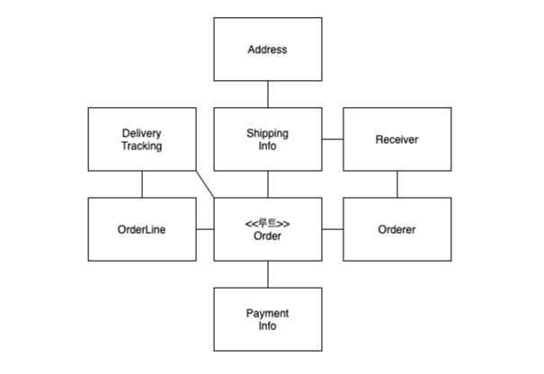

# 학습 목표

적어도 우리 회사 사람들끼리는 DDD에 관한 지식을 통합하자. 싱크를 맞추자! 결국 방법론!

베이스
서적 : [에릭 에반스 : DDD](https://product.kyobobook.co.kr/detail/S000001514402),  [최범균 : 도메인 주도 개발 시작하기](https://product.kyobobook.co.kr/detail/S000001810495)

# 1. DDD 3장 - 애그리거트

- Keywords : `애그리거트`

## 3.1 애그리거트란

- 백 개 이상의 테이블을 한장의 ERD에 모두 표시하면 개별 테이블 간의 관게를 파악하느라 큰 틀에서 데이터 구조를 이해하는데 어려움을 겪는다.
- 도메인 객체 모델이 복잡해지면 개별 구성요소 위주로 모델을 이해하게 되고 전반적인 구조나 큰 수준에서 도메인 간의 관계를 파악하기 어려워진다.

> 간단한 시스템에서 상위 수준의 개념을이용한 모델을 정리하고 모은다면 전반적인 관계를 이해하는데 도움이 된다.<br>
> 하지만 이것은 우리가 사용하는 개별 객체 수준으로 본다면 어떨까?


위 그림만 봐도, 개별 객체 수준에서 모델을 바라볼 경우 **관계를 파악하기 매우 어렵다!** <br>
즉 주요 도메인 요소간의 관계를 파악하기 어렵다는 것은 **코드를 변경하고 확장하는 것이 어려워 진다는 것**을 의미한다.<br>
이때, 복잡한 도메인을 이해하고 관리하기 쉬운 단위로 만드려면 **상위 수준에서 모델을 조망할 수 있는 방법이 필요**한데, 그 방법이 `애그리거트`이다.<br>


### 애그리거트의 특징

- 한 애그리거트에 속한 객체는 다른 애그리거트에 속하지 않는다.
    - 애그리거트는 독립된 객체 군이다.
    - 자기 자신을 관리할 뿐 다른 애그리거트를 관리하지 않는다.
- 애그리거트는 애그리거트간 경계를 갖는다.
- 애그리거트 경계를 설정하는 것은 `도메인 규칙`과 `요구사항`을 기반으로 진행된다.

### 애그리거트를 사용할 시 장점

- 모델들을 이해하는데 도움이 된다.
- 모델들의 일관성을 관리하는 기준이 된다.
- 복잡한 도메인을 단순한 구조로 만들어준다.

### 애그리거트 정의시 주의사항

애그리거트 정의간 `A가 B를 갖는다.`로 설계할 수 있는 요구사항이 있다면 A와 B를 한 애그리거트로 묶어서 생각하기 쉬운데<br>
이런 요구사항이 있다고 하더라도 **반드시 A와 B가 한 애그리거트에 속한다는 것을 의미하는 것은 아니다.**

예를 들어 `상품`,`리뷰`의 모델이 있다.<br>

- 상품 상세 페이지에 들어갈 경우 각 상품에 대한 고객의 리뷰를 확인할 수 있다.
    - 이 때, 상품에 리뷰가 포함된다고 생각해서 하나의 애그리거트로 구성할 수 있지만, 좀 더 생각해보면 상품과 리뷰는 함께 생성되지도 변경되지 않는 것을 알수있다.
    - 또 다른 관점으로 이해한다면, 화면(UI)에 종속되면 안된다!
- 상품을 변경하는 것의 주체가 상품 담당자라면 리뷰를 생성하고 변경하는 주체는 고객이다.
- 두 객체간의 변화가 서로에게 영향을 주지 않기 때문에 한 애그리거트에 속하기 보단, 각자 다른 애그리거트에 속하는 것이 맞다.


## 3.2 애그리거트 루트

> 애그리거트에 속한 모든 객체가 일관된 상태를 유지하기 위해선 애그리거트 전체를 관리할 주체가 필요한데,<br>
> 이 주체를 `애그리거트 루트`라고 한다.



### 도메인 규칙과 일관성

> 애그리거트 루트의 핵심 역할은 애그리거트의 일관성이 깨지지 않도록 하는 것이다.

- 애그리거트는 여러 객체로 구성되기 때문에 한 객체만 정상이면 안된다.
- 도메인 규칙을 지키려면 애그리거트 전체가 정상 상태를 가져야한다.
- 애그리거트 루트는 애그리거트 내의 모든 객체를 관리하며, 애그리거트 내의 객체들은 루트를 통해서만 접근할 수 있다.
    - 애그리거트 외부에서 애그리거트에 속한 객체를 직접 변경하면 안 된다.
    - 불필요한 중복을 피하고 애그리거트 루트를 통해서만 도메인 로직을 구현하게 만들려면 아래의 두가지를 습관적으로 적용해야한다.
        - 단순히 필드를 변경하는 `set` 메서드를 공개 범위로 만들지 않는다.
        - 밸류 타입은 불변으로 구현한다.

```java
public class Order {
    // 애그리거트 루트는 도메인 규칙을 구현한 기능을 제공한다.
    public void changeShippingInfo(ShippingInfo newShippingInfo) {
        verifyNotYetShipped();
        setShippingInfo(newShippingInfo);
    }

    private void verifyNotYetShipped() {
        if (state != OrderState.PAYMENT_WAITING && state != OrderState.PREPARING)
            throw new IllegalStateException("already shipped");
    }

    // set 메서드는 private 범위로 제한한다.
    private void setShippingInfo(ShippingInfo newShippingInfo) {
        // 불변 객체로 구현된 밸류 타입을 변경한다.
        this.shippingInfo = newShippingInfo;
    }
}
```

또한 애그리거트 루트는 애그리거트 내부의 다른 객체를 조합해서 기능을 완성한다.<br>
구성요소의 상태만 참조하는 것이 아니라, 기능 실행을 위임하기도 한다.

```java
public class Order {
    private OrderLines orderLines;

    public void changeOrderLines(List<OrderLine> newLines) {
        orderLines.changeOrderLines(newLines);
        this.totalAmounts = orderLines.getTotalAmounts();
    }
}
```

### 트랜잭션 범위

> 트랜잭션 범위는 작을수록 좋다.

- 잠금 대상이 많아질수록 동시에 처리할 수 있는 트랜잭션 개수가 줄어든다는 것을 의미하며 이것은 전체적인 성능을 떨어뜨리는 문제를 발생시킨다.
- 가능한 **한 트랜잭션의 범위는 한 개의 애그리거트만 수정**하도록 정의해야 한다.
    - 애그리거트에서 다른 애그리거트를 변경하지 않는 것을 의미한다.
    - 애그리거트는 서로 독립적이어야 하는데 한 애그리거트가 다른 애그리거트의 기능에 의존하기 때문에 결합도가 높아진다.
- 특이 케이스로 두 개 이상의 애그리거트를 한 트랜잭션에서 관리해야 할 수도 있다.
    - 한 트랜잭션에서 두 개 이상의 애그리거트를 수정해야 한다면, 응용서비스에서 두 애그리거트를 수정하도록 구현한다.

```java
public class ChangeOrderService {
    @Transactional
    public void changeShippingInfo(OrderId id, ShippingInfo newInfo, boolean isUse) {
        // Order 애그리거트 수정
        Order order = orderRepository.findById(id);
        order.shipTo(newInfo);

        // Member 애그리거트 수정
        if (isUse) {
            Member member = findMember(order.getOrderer);
            member.changeAddress(newInfo.getAddress);
        }
    }
}
```

다음의 경우 한 트랜잭션에서 두 개 이상의 애그리거트를 변경하는 것을 고려할 수 있다.

- 팀 표준 : 팀이나 조직의 표준에 따라 응용서비스의 기능을 한 트랙잭션에서 수행해야 할 경우
- 기술 제약 : 기술적으로 이벤트 방식을 도입할 수 없는 경우, 한 트랜잭션에서 다수의 애그리거트를 수정해서 일관성을 처리
- UI 구현의 편리 : 사용자의 편리함을 위해 한 트랜잭션에서 여러 애그리거트의 상태를 변경할 수 있다.

## 3.3 애그리거트를 팩토리로 사용하기

> 지금까지 알아본 DDD 관점에서 아래 로직중 잘못됐다고 생각하는 부분은?

```java
// 상점 상태가 차단이 아닌 경우에만 상품을 생성하는 로직
public class RegisterProductService {
    public ProductId registerNewProduct(NewProductRequest req) {
        Store account = accountRepository.findStoreById(req.getStoreId());
        checkNull(account);
        if (!account.isBlocked()) {
            throw new StoreBlockedException();
        }
        ProductId id = productRepository.nextId();
        Product product = new Product(id, account.getId(), ...);
        productRepository.save(product);
        return id;
    }
}
```
- Store가 Product를 생성할 수 있는지를 판단하고 Product를 생성하는 것은 논리적으로 하나의 도메인 기능인데 해당 기능을 응용 서비스에서 구현하고 있다.
  - **중요한 도메인 로직 처리가 응용 서비스에 노출**되었다.

```java
public class Store {
    public Product createProduct(ProductId newProductId, ...생략) {
        if (isBlocked()) throw new StoreBlockedException();
        return new Product(newProductId, getId(), ...생략);
    }
}
```
Store 애그리거트에 Product 애그리거트를 생성하는 팩토리 역할을 할 수 있도록 구성할 수 있다.
```java
public class RegisterProductService {
  public ProductId registerNewProduct(NewProductRequest req) {
    Store account = accountRepository.findStoreById(req.getStoreId());
    checkNull(account);
    ProductId id = productRepository.nextId();
    Product product = account.createProduct(id, account.getId(), ...); // Store에서 직접 생성
    productRepository.save(product);
    return id;
  }
}
```
Store에서 팩토리 역할을 수행하면서 다음과 같은 차이점이 생긴다.
- 응용 서비스에서 더 이상 Store의 상태를 확인하지 않는다.
- Store 관련 로직은 전부 Store에서 구현된다.
- Product 생성 관련 로직 또한 Store 내부에서 변경된다.
- 도메인의 응집도가 높아집니다.
- "Store가 Product를 생성한다"는 도메인 개념이 코드에 그대로 반영되어 있어 의도가 명확하다.
  - 이는 유비쿼터스 언어(Ubiquitous Language)를 코드로 잘 표현한 예시이다.

### 마무리
> 위의 예제에서 이런 궁금증이 생길 수 있다.<br>
> - Stroe와 Product는 다른 애그리거트 아닌가요?
> - Store가 Product를 생성하는 것은 올바른가요?

복습!
- 애그리거트는 서로 직접적인 참조를 가지지 않아야 한다.
- 다른 애그리거트를 수정하면 안 된다.
- 다른 애그리거트의 내부 상태를 직접 변경하면 안 된다. 

하지만 `Store.createProduct()` 케이스는 이 원칙들을 위반하지 않는다.

```java
// 1. 잘못된 예시 - 애그리거트 간 직접 참조
public class Store {
  private List<Product> products; // ❌ 다른 애그리거트를 직접 참조

  public void addProduct(Product product) {
    products.add(product); // ❌ 직접 관계를 맺음
  }
}

// 2. 좋은 예시 - 팩토리 메서드 패턴
public class Store {
  public Product createProduct(ProductId newProductId, ...) {
    if (isBlocked()) throw new StoreBlockedException();
    return new Product(newProductId, getId(), ...); // ⭕️ 단순히 새 객체를 생성만 함
  }
}
```

- 1번 예시는 Store가 Product들을 직접 가지고 있고 관리한다. (진짜 참조)
- 2번 예시는 Store가 단지 Product를 생성하는 "방법"만 알고 있다. (생성 책임만)

따라서 `Store.createProduct()`는<br>
- 다른 애그리거트를 참조하지 않음
- 단순히 새로운 Product **객체를 생성만** 할 뿐
- 생성된 Product는 ProductRepository가 따로 관리한다.

이런 식의 팩토리 메서드 패턴은 도메인 규칙을 지키면서도 객체 생성의 복잡성을 잘 캡슐화할 수 있는 방법이다.
