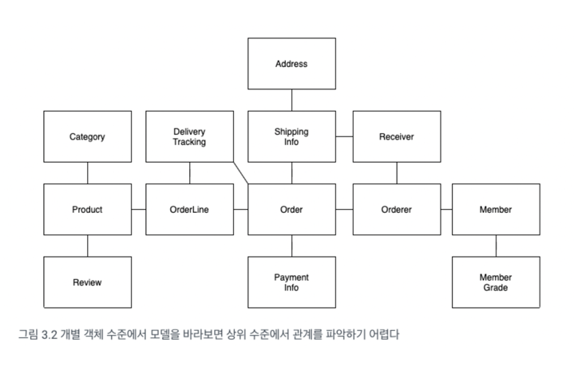
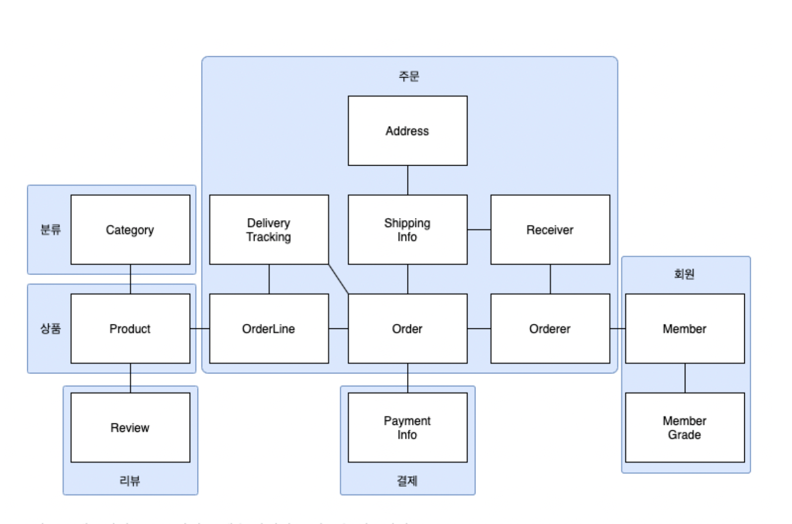
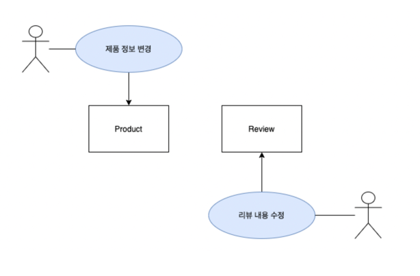

# 학습 목표

적어도 우리 회사 사람들끼리는 DDD에 관한 지식을 통합하자. 싱크를 맞추자! 결국 방법론!

베이스 서적 : [에릭 에반스 : DDD](https://product.kyobobook.co.kr/detail/S000001514402),  [최범균 : 도메인 주도 개발 시작하기](https://product.kyobobook.co.kr/detail/S000001810495)

# 1. DDD 3장 - 애그리거트

- Keywords : `애그리거트`

## 3.1 애그리거트란
- 백 개 이상의 테이블을 한장의 ERD에 모두 표시하면 개별 테이블 간의 관게를 파악하느라 큰 틀에서 데이터 구조를 이해하는데 어려움을 겪는다.
- 도메인 객체 모델이 복잡해지면 개별 구성요소 위주로 모델을 이해하게 되고 전반적인 구조나 큰 수준에서 도메인 간의 관계를 파악하기 어려워진다.
> 간단한 시스템에서 상위 수준의 개념을이용한 모델을 정리하고 모은다면 전반적인 관계를 이해하는데 도움이 된다. 
> 하지만 이것은 우리가 사용하는 개별 객체 수준으로 본다면 어떨까?

위 그림만 봐도, 개별 객체 수준에서 모델을 바라볼 경우 **관계를 파악하기 매우 어렵다!**  
즉 주요 도메인 요소간의 관계를 파악하기 어렵다는 것은 **코드를 변경하고 확장하는 것이 어려워 진다는 것**을 의미한다. 
이때, 복잡한 도메인을 이해하고 관리하기 쉬운 단위로 만드려면 **상위 수준에서 모델을 조망할 수 있는 방법이 필요**한데, 그 방법이 `애그리거트`이다. 

### 애그리거트의 특징
- 한 애그리거트에 속한 객체는 다른 애그리거트에 속하지 않는다.
  - 애그리거트는 독립된 객체 군이다.
  - 자기 자신을 관리할 뿐 다른 애그리거트를 관리하지 않는다.
- 애그리거트는 애그리거트간 경계를 갖는다.
- 애그리거트 경계를 설정하는 것은 `도메인 규칙`과 `요구사항`을 기반으로 진행된다.

### 애그리거트를 사용할 시 장점
- 모델들을 이해하는데 도움이 된다.
- 모델들의 일관성을 관리하는 기준이 된다.
- 복잡한 도메인을 단순한 구조로 만들어준다.

### 애그리거트 정의시 주의사항
애그리거트 정의간 `A가 B를 갖는다.`로 설계할 수 있는 요구사항이 있다면 A와 B를 한 애그리거트로 묶어서 생각하기 쉬운데 
이런 요구사항이 있다고 하더라도 **반드시 A와 B가 한 애그리거트에 속한다는 것을 의미하는 것은 아니다.**

예를 들어 `상품`,`리뷰`의 모델이 있다. 
- 상품 상세 페이지에 들어갈 경우 각 상품에 대한 고객의 리뷰를 확인할 수 있다.
  - 이 때, 상품에 리뷰가 포함된다고 생각해서 하나의 애그리거트로 구성할 수 있지만, 좀 더 생각해보면 상품과 리뷰는 함께 생성되지도 변경되지 않는 것을 알수있다.
  - 또 다른 관점으로 이해한다면, 화면(UI)에 종속되면 안된다!
- 상품을 변경하는 것의 주체가 상품 담당자라면 리뷰를 생성하고 변경하는 주체는 고객이다.
- 두 객체간의 변화가 서로에게 영향을 주지 않기 때문에 한 애그리거트에 속하기 보단, 각자 다른 애그리거트에 속하는 것이 맞다.

