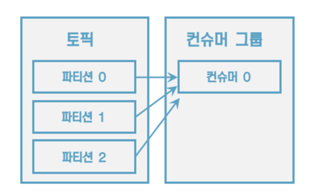
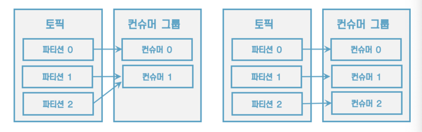
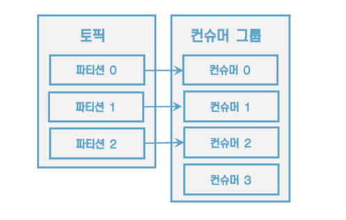
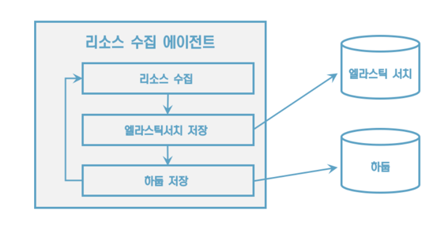
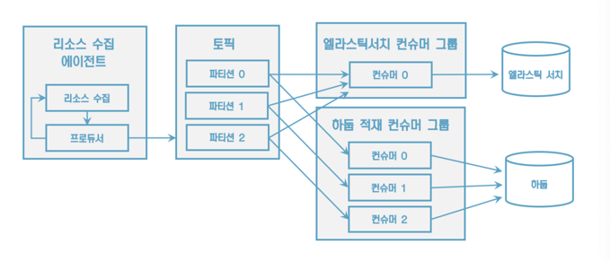
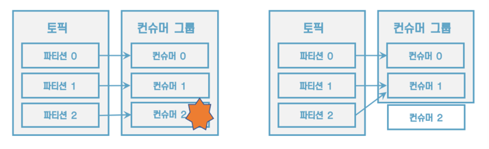

# 3. 카프카 기본 개념 설명

## 3.1 카프카 브로커, 클로스터 주키퍼

## 카프카 브로커

- 하나의 서버에는 한 개의 카프카 브로커가 실행된다.
- **3대 이상을 묶어서 클러스터**로 운영한다.
- 데이터를 전달받아 토픽의 파티션에 데이터를 저장하고, 전달한다.
- 데이터는 **파일 시스템**에 저장된다.

> 카프카는 데이터를 메모리나 데이터베이스가 아니라 파일에 저장하는데, `파일 시스템에 저장하면 파일 입출력으로 인해 느리지 않을까?`
> - 카프카는 페이지 캐시(page cache)를 사용해 디스크 입출력 속도를 높였다.
> - 한 번 읽은 파일의 내용은 메모리의 페이지 캐시 영역에 저장된다.
> - JVM 상에서 동작하는 카프카가 직접 캐시를 구현하는 게 아니다. (그랬더라면 gc가 자주 일어났을 것이다.)
    >

- 그래서 카프카 힙 사이즈를 크게 설정하지 않아도 된다.

### 데이터 복제, 싱크

장애 발생시에도 데이터를 유실하지 않고 안전하게 사용하기 위해서 데이터 복제(싱크)를 진행한다.<br>
카프카의 데이터 복제는 **파티션 단위**로 이루어지며 복제된 파티션은 `리더` & `팔로워`로 구성된다.<br>

- 팔로워의 파티션은 리더 파티션으로부터 데이터를 가져와서 자신의 파티션에 저장한다.
- 복제 개수만큼 저장 용량이 증가한다는 단점을 가지고 있다.
- 리더 파티션에 장애가 발생하면 다른 팔로워 파티션이 그 기능을 위임 받는다.

### 컨트롤러

클러스터의 다수 브로커 중 한 대가 컨트롤러의 역할을 한다.<br>

- 컨트롤러는 다른 브로커들의 상태를 체크한다.
- 브로커가 클러스터에서 빠지는 경우 해당 브로커에 존재하는 **리더 파티션을 재분배한다**.

### 데이터 삭제

카프카는 다른 메시징 플랫폼과 다르게 컨슈머가 데이터를 가져가더라도 토픽의 데이터는 삭제되지 않는다.<br>
컨슈머나 프로듀서가 데이터 삭제를 요청할 수도 없다. **오직 브로커만이 데이터를 삭제할 수 있다.**

- 데이터 삭제는 파일 단위로 이루어지는데 이 단위를 `로그 세그먼트`라고 부른다.
    - 이 세그먼트에는 다수의 데이터가 들어있기 때문에 일반적인 데이터베이스처럼 특정 데이터를 선별해서 삭제할 수 없다.
- 닫힌 세그먼트 파일은 `log.retention.bytes` 또는 `log.retention.ms` 옵션에 설정값이 넘으면 삭제된다.
- 카프카는 데이터를 삭제하지 않고 메세지 키를 기준으로 오래된 데이터를 압축하는 정책(토픽 압축 정책)을 가져갈 수 있다.

### 코디네이터

코디네이터는 컨슈머 그룹의 상태를 체크하고 파티션을 컨슈머와 매칭되도록 분배하는 역할을 한다.

- 브로커 중 하나가 코디네이터 역할을 수행한다.
- 파티션을 컨슈머로 재할당하는 과정을 수행한다.
    - 즉 **리밸런스**를 수행한다.

### 주키퍼란?

여기까지는 브로커에 대해 알아보았다. 그러면 주키퍼(zookeeper)는 뭘까?

- 카프카의 메타데이터를 관리한다. (브로커 정보(어느 보안 규칙으로 통신하는지, jmx port 상태 정보, host 정보 등), 컨트롤러 정보, 토픽 정보 등)
- 카프카 서버에서 직접 주키퍼에 붙으려면 카프카 서버에서 실행되고 있는 주키퍼에 연결해야 한다.

---

## 3.2 토픽과 파티션

### 토픽

- 데이터를 구분하기 위해 사용하는 단위
- 토픽은 **1개 이상의 파티션을 소유**한다.
- 파티션에는 프로듀서가 보낸 데이터들이 들어가 저장되는데, 이 데이터를 `레코드(record)`라고 부른다.
- 토픽의 레코드는 다양한 목적을 가진 여러 컨슈머 그룹들이 데이터를 여러 번 가져갈 수 있다.

### 파티션

- 카프카의 병렬 처리의 핵심으로 그룹으로 묶인 컨슈머들이 레코드(=데이터)를 병렬로 처리할 수 있게 매칭된다.
    - 파티션은 큐형태로 FIFO(First In First Out) 구조이나, 큐와 다르게 pop 되었다고 데이터가 삭제되지 않는다.
- 컨슈머의 처리량이 한정된 상황에서 많은 레코드를 병렬로 처리하기 위한 가장 좋은 방법은 컨슈머의 개수를 늘리는 것이다.
    - 컨슈머 개수를 늘리면서 동시에 파티션 개수도 늘리면 처리량을 증가시킬 수 있다.

#### 토픽이름 제약조건

> 토픽 이름을 생성할때 제약조건이 있다.

- 빈 문자열 지원 X
- 토픽이름은 마침표 하나 또는 둘로 생성될 수 없다.
- 토픽 이름의 길이는 249자 미만이어야 한다.
- 토픽 이름은 영어 대소문자, 숫자, 마침표(.), 언더바(_), 하이픈(-) 조합으로 생성할 수 있다.
- 카프카 내부 로직 관리 목적으로 사용되는 토픽(__consumer_offsets,__transaction_state)은 생성 불가능하다.
- 내부적으로 사용하는 로직 때문에 토픽 이름에 마침표와 언더바가 동시에 들어가면안된다.
    - 생성은 가능하나, 이슈가 발생할 수 있기 때문에 WARNING표시

#### 의미있는 토픽 이름을 짓는다.

예시)

- <환경>.<팀명>.<애플리케이션명>.<메시지타입>
    - `prod.marketing.sms-platform.json`
- <프로젝트명>.<서비스명>.<환경>.<이벤트명>
    - `commerece.payment.prod.notification`
- <환경>.<서비스명>.<JIRA번호>.<메시지타입>
    - `dev.email-sender.jira-1234.email-vo-custom`
- <카프카클러스터명>.<환경>.<서비스명>.<메시지타입>
    - `aws-kafka.live.marketing-platform.json`
- **토픽 이름은 변경할 수 없다. 삭제 후 다시 생성해야 한다.**

### 레코드

> 레코드 : `오프셋`, `타임스탬프`+`메세지 키`+`메세지 값`,`헤더`로 구성된다.<br>
> 프로듀서가 생성한 레코드가 브로커에 전송되면 오프셋과 타임스탬프가 지정되어 저장된다. <br>
> 브로커에 한 번 적재된 레코드는 수정할 수 없고, 로그 리텐션 기간 또는 용량에 따라서만 삭제된다.

- `메세지 키` : 메세지 값을 순서대로 처리하거나 종류를 나타내는 값으로 해당 키 값의 해시값을 토대로 파티션을 지정한다.
    - 동일 메세지 키라면 동일 파티션으로 들어간다.
    - 다만 어느 파티션에 지정될 지 알 수 없고 파티션 개수가 변하면 메세지 키와 파티션 매칭이 달라지게 되므로 주의해야 한다.
    - 메세지 키를 설정하지 않으면 null로 설정되고, 메세지 키가 null인 레코드는 기본 설정 파티셔너에 따라 파티션에 분배된다.
    - **파티션 개수 변경 시 재분배됨으로 운영 중에 값을 변경해서는 안됨**
- `메세지 값` :  실제 처리할 데이터
    - 메세지 키와 메세지 값은 직렬화되어 브로커로 전송된다.
    - 컨슈머는 직렬화와 동일한 형태로 역직렬화를 수행해야 한다. (프로듀서가 String으로 직렬화 한것을 컨슈머가 Integer로 역직렬화하면 에러가 발생한다.)
- `오프셋` : 컨슈머가 데이터를 가져갔음을 나타내는 위치값
- `타임스탬프` : 프로듀서에서 해당 레코드가 생성된 시점 또는 브로커에 적재된 시점을 의미함
- `헤더` : 레코드의 추가적인 정보를 담는 메타데이터 저장소 용도

### 프로듀서 API

> 카프카에서 데이터의 시작점을 프로듀서이다!

- 카프카에 **필요한 데이터를 선언**하고 **브로커의 특정 토픽의 파티션에 전송**한다.
- 데이터를 전송시 리더 파티션을 가지고 있는 카프카 브로커와 직접 통신한다.
- 프로듀서는 데이터를 직렬화하여 카프카 브로커로 보낸다.
    - 자바에서 선언 가능한 모든 형태 (기본형,참조형,동영상 같은 바이너리 데이터도)를 브로커로 전송할 수 있다.


- `ProductRecord` 전송할 데이터의 인스턴스를 만든다.
- 파티셔너에 의해 구분된 레코드는 데이터를 전송하기 위해 `accumulator`에 데이터를 버퍼로 쌓아놓고 발송한다.
- `UniformStickyPartitioner와` `RounderRobinPartitioner` 2개 파티션이 있다.
    - RoundRobinPartitioner는 레코드가 들어오는대로 순회하며 전송하기 때문에 배치로 묶이는 빈도가 적어서 카프카 2.4.0부터 UniformStickyPartitioner가 기본 파티셔너로
      설정되었다.
- sender 스레드는 accumulator에 쌓인 배치 데이터를 가져가 카프카 브로커로 전송한다.
- 압축 옵션을 통해 브로커로 전송 시 압축 방식을 정할 수 있다.
    - 압축 옵션을 정하지 않으면 압축 안 된 상태로 전송된다.
    - 압축 옵션으로는 `gzip`, `snappy`, `lz4`, `zstd`를 지원한다.
    - 압축을 하면 네트워크 처리량에서 이득을 보지만, 압축 하는 데 CPU 또는 메모리 리소스를 사용하므로 적절한 압축 옵션을 선택하는 게 중요하다. (프로듀서뿐만 아니라 컨슈머 측에서도 리소스가 사용됨을
      기억하자.)

#### 프로듀서 주요 옵션

> 프로듀서 어플리케이션을 실행할 때 설정해야 하는 필수 옵션과 선택 옵션이 있다.

#### 필수 옵션

| 옵션명                 | 설명                                                     |
|---------------------|--------------------------------------------------------|
| `bootstrap.servers` | 프로듀서가 데이터를 전송할 대상 카프카 클러스터에 속한 브로커의 호스트 포트를 1개이상 작성한다. |
| `key.serializer`    | 레코드의 메시지 키를 직렬화하는 클래스를 지정한다.                           |
| `value.serializer`  | 레코드의 메시지 값을 직렬화하는 클래스를 지정한다.                           |

#### 선택옵션

| 옵션명                 | 설명                                                                                                                                                                                                                                                                      |
|---------------------|-------------------------------------------------------------------------------------------------------------------------------------------------------------------------------------------------------------------------------------------------------------------------|
| `acks`              | 프로듀서가 전송한 데이터가 브로커들에 정상적으로 저장되었는지 전송 성공 여부를 확인하는데에 사용하는 옵션이다. `0`, `1`, `-1` 중 하나로 설정할 수 있다.<br>1: 기본값으로써 리더 파티션에 데이터가 저장되면 전송 성공으로 판단<br>0: 프로듀서가 전송한 즉시 브로커에 데이터 저장여부와 상관없이 성공으로 판단<br>-1: 토픽의 `min.insync.replicas` 개수에 해당하는 리더 파티션과 팔로워 파티션에 데이터가 저장되면 성공하는 것으로 판단. |
| `buffer.memory`     | 브로커로 전송할 데이터를 배치로 모으기 위해 설정할 버퍼 메모리양을 정한다. 기본값은 32MB                                                                                                                                                                                                                    |
| `retries`           | 프로듀서가 브로커로부터 에러를 받고 난 뒤 재전송을 시도하는 횟수를 지정한다 기본값은 Integer.MAX                                                                                                                                                                                                             |
| `batch.size`        | 배치로 전송할 레코드 최대 용량을 지정한다. 너무 작게 설정하면 프로듀서가 브로커로 더 자주 보내기 때문에 네트워크 부담이 있고 너무크게 설정하면 메모리를 더 많이 사용하게 되는 점을 주의해야한다<br>`default: 16384`                                                                                                                                       |
| `linger.ms`         | 배치를 전송하기전까지 기다리는 최소시간이다. 기본값은 0이다                                                                                                                                                                                                                                       |
| `partitioner.class` | 레코드를 파티션에 전송할 때 적용하는 파티셔너 클래스를 지정한다. 기본값은<br>`org.apache.kafka.clients.producer.internals.DefaultPartioner`                                                                                                                                                             |
| `transactional.id`  | 프로듀서가 레코드를 전송할 때 레코드를 트랜잭션 단위로 묶음지 여부를 설정한다. 프로듀서의 고유한 트랜잭션 아이디를 설정할 수 있다.                                                                                                                                                                                              |

#### 메시지 키를 가진 데이터를 전송하는 프로듀서

```java
// hong이 key가 들어갈 자리
ProducerRecord<String, String> record = new ProducerRecord<>(TOPIC_NAME, "hong", messageValue);
```

파티션을 직접 넣고 싶다면 다음과 같이 설정하면 된다.

```java
int partitionNo = 0;
ProducerRecord<String, String> record = new ProducerRecord<>(TOPIC_NAME, partitionNo, messageKey, messageValue);
```

#### 커스텀 파티셔너를 가지는 프로듀서

프로듀서 사용 환경에 따라 특정 데이터를 가지는 레코드를 특정 파티션으로 보내야 할때가 있다.

- 기본 설정 파티셔너를 사용할 경우 메시지 키의 **해시값**을 파티션에 매칭하여 데이터를 전송하므로 어느 파티션에 들어가는지 알 수 없다.
- 이때 `Partitioner` 인터페이스를 사용하여 **사용자 정의 파티셔너**를 생성하면 특정값을 가진 메시지키에 대해서 무조건 정해진 파티션으로 데이터를 전송하도록 설정 가능

```java
public class CustomPartitioner implements Partitioner {
    @Override
    public int partition(String topic, Object key, byte[] keyBytes, Object value, byte[] valueBytes, Cluster cluster) {
        if (keyBytes == null) {
            throw new InvalidPartitionsException("Need Message Key");
        }
        // 특정 파티션 값으로 보내도록
        if (((String) key).equals("hong")) {
            return 0;
        }
        List<PartitionInfo> partitions = cluster.partitionsForTopic(topic);
        int numPartitions = partitions.size();

        // 기본 값
        return Utils.toPositive(Utils.murmur2(keyBytes) % numPartitions);
    }

    @Override
    public void close() {
        /*  */
    }

    @Override
    public void configure(Map<String, ?> map) {
        /*  */
    }
}
```

### 브로커 정상 전송 여부를 확인하는 메서드

- `KafkaProducer`의 `send()` 메서드는 Future 객체를 반환한다.
    - 이 객체는 RecordMetadata의 비동기 결과를 표현하는 것으로 ProducerRecord가 카프카 브로커에 정상적으로 적재되었는지에 대한 데이터가 포함되어 있다.
- `get()` 메서드를 사용하면 프로듀서로 보낸 데이터의 결과를 동기적으로 가져올 수 있다.

```java
ProducerRecord<String, String> record = new ProducerRecord<>(TOPIC_NAME, messageValue);
RecordMetadata metadata = producer.send(record).get();
logger.

info(metadata.toString());
```

- `send()`의 결과값은 카프카 브로커로부터 응답을 기다렸다가 브로커로부터 응답이 오면 RecordMetadata 인스턴스를 반환한다.
- 레코드가 정상적으로 적재되었다면, `토픽 이름`과 `파티션 번호`, `오프셋 번호`가 출력된다.
- 하지만 동기로 프로듀서의 전송 결과를 확인하는 것은 **빠른 전송에 허들**이 될 수 있다.
    - 프로듀서가 전송하고 난 뒤 브로커로부터 전송에 대한 응답 값을 받기 전까지 대기하기 때문이다.
- 따라서 **비동기로 결과를 확인할 수 있도록 CallBack 인터페이스**를 제공하고 있다.
- 사용자는 사용자 정의 Callback 클래스를 생성하여 레코드의 전송 결과에 대응 하는 로직을 만들 수 있다.
- `onCompletion()` 메서드는 레코드의 전송 결과에 대한 정보를 담은 RecordMetadata와 Exception을 받아서 처리할 수 있다.

```java
public class CustomCallback implements Callback {
    @Override
    public void onCompletion(RecordMetadata metadata, Exception exception) {
        if (exception != null) {
            logger.error("Error Occurred", exception);
        } else {
            logger.info(metadata.toString());
        }
    }
}
```

- 비동기 처리로 데이터 처리를 빠르게 할 수 있지만 전송하는 데이터의 순서가 중요한 경우 사용하면 안 된다.

### 컨슈머 API
> 브로커에 적재된 데이터를 가져와 필요한 처리를 함
```java
public class SimpleConsumer {
    private final static Logger logger = LoggerFactory.getLogger(SimpleProducer.class);
    private final static String TOPIC_NAME = "test";
    private final static String BOOTSTRAP_SERVERS = "localhost:9092";
    private final static String GROUP_ID = "test-group";

    public static void main(String[] args) {
        Properties configs = new Properties();
        configs.put(ConsumerConfig.BOOTSTRAP_SERVERS_CONFIG, BOOTSTRAP_SERVERS);
        configs.put(ConsumerConfig.GROUP_ID_CONFIG, GROUP_ID);
        configs.put(ConsumerConfig.KEY_DESERIALIZER_CLASS_CONFIG, StringDeserializer.class.getName());
        configs.put(ConsumerConfig.VALUE_DESERIALIZER_CLASS_CONFIG, StringDeserializer.class.getName());

        KafkaConsumer<String, String> consumer = new KafkaConsumer<>(configs);
        consumer.subscribe(Arrays.asList(TOPIC_NAME));

        while (true) {
            ConsumerRecords<String, String> records = consumer.poll(Duration.ofSeconds(1));
            for (ConsumerRecord<String, String> record : records) {
                logger.info("{}", record);
            }
        }
    }
}
```
- ※ 컨슈머 그룹을 기준으로 오프셋을 관리하기 때문에 `subscribe()` 메서드를 사용하여 토픽을 구독하는 경우 컨슈머 그룹을 선언해야 됨
### 컨슈머 주요 개념
> 토픽의 파티션으로부터 데이터를 가져가기 위해 컨슈머를 운영하는 방법은 크게 2가지가 있다.

 <br>
[그림] **컨슈머 1개로 이루어진 컨슈머 그룹이 3개의 파티션에 할당**<br>

- 1개 이상의 컨슈머로 이루어진 **컨슈머 그룹**을 운영 하는 것
- **토픽의 특정 파티션만 구독**하는 컨슈머를 운영하는 것

<br>
[그림] **컨슈머 2개, 컨슈머 3개인 경우**<br>
> 컨슈머 그룹으로 묶인 컨슈머가 토픽을 구독해서 데이터를 가져갈 때, **1개의 파티션은 최대 1개의 컨슈머에 할당** 가능하다.<br>
> 그리고 1개 컨슈머는 여러 개의 파티션에 할당될 수 있다. 이러한 특징으로 컨슈머 그룹의 컨슈머 개수는 가져가고자 하는 토픽의 파티션 개수보다 같거나 작아야 한다.<br>

<br>
[그림] **컨슈머 1개가 놀고 있는 모습**<br>
> 3개의 파티션을 가진 토픽을 효과적으로 처리하기 위해서는 3개 이하의 컨슈머 그룹으로 운영해야 한다.<br>
> 만약 4개의 컨슈머로 이루어진 컨슈머 그룹으로 3개의 파티션을 가진 토픽에서 데이터를 가져가기 위해 할당하면 1개의 컨슈머는 파티션을 할당받지 못하고 유휴상태로 남게 된다.

<br>
[그림] **동기 로직으로 돌아가는 에이전트 애플리케이션**<br>
컨슈머 그룹은 다른 컨슈머 그룹과 격리되는 특징을 가지고 있다.

<br>
[그림] **컨슈머 그룹으로 적재 로직을 분리하여 운영**

#### 컨슈머 그룹의 컨슈머에 장애가 발생하면?
- 장애가 발생한 컨슈머에 할당된 파티션은 장애가 발생하지 않은 컨슈머에 소유권이 넘어간다.
- 이러한 과정을 `리밸런싱 (rebalancing)`이라고 한다.

리밸런싱은 크게 두가지 상황에 일어난다.
1. 컨슈머가 추가 되는 상황
2. 컨슈머가 제외 되는 상황
<br>
[그림] 컨슈머 장애 발생 시 리밸런싱 발생

- 리밸런싱은 유용하지만 자주 일어나서는 안 된다!
- 리밸런싱이 발생할 때 파티션의 소유권을 컨슈머로 재할당하는 과정에서 해당 컨슈머 그룹의 컨슈머들이 토픽의 데이터를 읽을 수 없기 때문이다.
- 그룹 조정자(group coordinator)는 리밸런싱을 발동시키는 역할을 하는데 컨슈머 그룹의 컨슈머가 추가되거나 제외될 때마다 그룹 조정자가 리밸런싱을 발동시킨다.

장애 발생 시 자동으로 리밸런싱되어 정상 컨슈머들끼리 데이터 처리를 재분배하여 운영됨으로 서비스 장애를 막을 수 있다.<br>
그러므로 반드시 데이터 처리 중 발생한 리밸런싱에 대응하는 코드를 작성해야 한다.

#### 컨슈머 오프셋 커밋
> 컨슈머는 consumer_offset 에 카프카 브로커로부터 데이터를 어디까지 가져갔는지 커밋을 통해 기록한다.<br> 
> 만약 데이터 처리 후 consumer_offset에 기록되지 않으면 중복으로 재처리될 수 있다. <br>
> 그러므로 오프셋 커밋을 정상적으로 처리했는지 검증해야 된다.
 
오프셋 커밋 방법 
1. 명시적: 직접 데이터 처리 후 커밋하는 방법 (중복처리 가능성 없음)
   - poll() 호출 후 반환받은 데이터 처리의 완료 후 `commitSync()`- 동기식, `commitAsync()` - 비동기식 메소드로 직접 커밋한다.
   - 개별 레코드 단위 커밋을 원하는 경우 `commitSycn()` 메소드에 `Map<TopicPartition, OffsetAndMetadata>` 인스턴스를 파라미터로 넘기면 된다.
2. 비명시적 : `enable.auto.commit = true` 옵션으로 일정 가격마다 자동 커밋하는 방법 (중복 처리 가능성 다소 있음)
   - poll() 호출 이후 `auto.commit.interval.ms`에 설정된 값 이상이 지나면 그시점에 읽은 레코드의 오프셋을 커밋한다.

### 컨슈머 옵션
#### 주요 옵션

| 옵션 | 설명 |
|------|------|
| `bootstrap.servers` | 데이터 전송 대상 카프카 클러스터에 속한 브로커 호스트 이름 (2개 이상 입력 권장) |
| `key.deserializer` | 메시지 키 역직렬화 클래스 지정 |
| `value.deserializer` | 메시지 값 역직렬화 클래스 지정 |

#### 선택 옵션

| 옵션 | 설명                                                                                                                                                            |
|------|---------------------------------------------------------------------------------------------------------------------------------------------------------------|
| `group.id` | 컨슈머 그룹 아이디, subscribe() 메서드로 토픽 구독할 경우 반드시 선언 필요                                                                                                              |
| `auto.offset.reset` | 저장된 오프셋이 없는 경우 어디서부터 읽을지 선택<br> (latest: 가장 최근에 넣은 오프셋부터, earliest: 가장 오래전에 넣은 오프셋부터, none: 컨슈머 그룹이 커밋한 기록을 확인해 없는 경우 에러 반환, 있으면 기존 커밋 이후 오프셋부터, 기본값: latest) |
| `enable.auto.commit` | 자동 커밋 동작 여부                                                                                                                                                   |
| `auto.commit.interval.ms` | 자동 커밋일 경우 커밋 간격 (기본값: 5000)                                                                                                                                   |
| `max.poll.records` | poll() 호출 시 반환되는 레코드 개수                                                                                                                                       |
| `session.timeout.ms` | 컨슈머와 브로커 연결이 끊기는 최대시간 (리밸런싱 발생 기준시간)                                                                                                                          |
| `heartbeat.interval.ms` | 하트비트 전송 간격 시간                                                                                                                                                 |
| `max.poll.interval.ms` | poll() 호출 간격의 최대 시간, poll 호출 이후 데이터 처리에 시간이 너무 많이 걸리는 경우 비정상으로 판단하여 리밸런싱함                                                                                     |
| `isolation.level` | 트랜잭션 프로듀서가 레코드를 트랜잭션 단위로 보낼 경우 사용, read_committed(커밋 완료된 레코드만 읽음), read_uncommitted(커밋 상관없이 모든 레코드 읽음) 설정 가능(기본값: read_committed)                             |

### 리밸런스 리스너
> `poll()` 메서드를 통해 반환받은 데이터를 모두 처리하기 전에 리밸런스가 발생하면 데이터가 중복 처리 될 수 있다.<br>
> 왜냐하면 데이터중 일부를 처리했으나 커밋을 하지 않았기 때문이다.
- `ComsumerRebalanceListener` 인터페이스를 통해 리밸런싱을 감지할 수 있다.
  - `onPartitionAsstigned()` (=리밸런스 완료 후 호출), 
  - `onPartitionRevoked()` (=리밸런스 시작 전에 호출) 메서드를 통해서 처리할 수 있다. 
- `onPartitionRevoked` 메소드에서 마지막 처리 기준으로 커밋을 수행시킴으로 중복처리를 방지할 수 있음


### 어드민 API
```java
Properties configs = new Properties();
configs.put(ProducerConfig.BOOTSTRAP_SERVERS_CONFIG, "my-kafka:9002");
AdminClient admin = AdminClient.create(configs);
```

- 실제 운영 환경에서는 프로듀서, 컨슈머를 통해 데이터를 주고받는 것만큼 카프카에 설정된 내부 옵션을 설정하고 확인하는 것이 중요하다.
- 이를 위해 AdminClient 클래스가 있다. 이 클래스를 통해 카프카 클러스터의 설정을 확인하고 변경할 수 있다.
