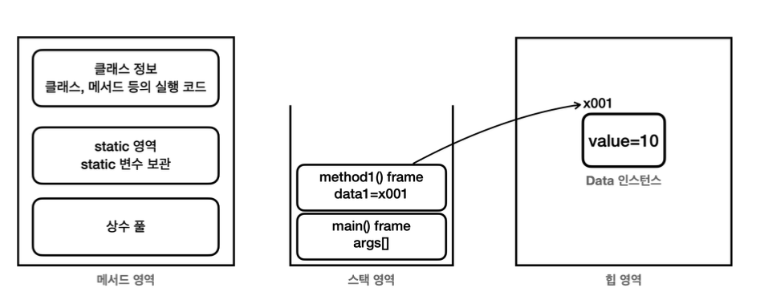

# 👾 자바 고급1

- **메서드 영역** : 메서드 영역은 프로그램을 실행하는데 필요한 공통 데이터를 관리한다. 이영역은 프로그램의 모든 영역에서 공유한다.
  - 클래스 정보 : 클래스의 실행 코드 (바이트 코드), 필드, 메서드와 생성자 코드등 모든 실행 코드가 존재한다.
  - static 영역 : static 변수들을 보관한다.
  - 런타임 상수 풀 : 프로그램을 실행하는데 필요한 공통 리터럴 상수를 보관한다.
- **스택 영역(Stack Area)** : 자바 실행 시, 하나의 실행 스택이 생성된다. 각 스택 프레임은 지역 변수, 중간 연산 결과, 메서드 호출 정보 등을 포함한다.
  - 스택 프레임: 스택 영역에 쌓이는 네모 박스가 하나의 스택 프레임이다. 메서드를 호출할 때 마다 하나의 스택 프레임이 쌓이고, 메서드가 종료되면 해당 스택 프레임이 제거된다.
- **힙 영역(Heap Area)** : 객체(인스턴스)와 배열이 생성되는 영억이다. GC가 이루어지는 주요 영역이며, 더 이상 참조되지 않는 객체는 GC에 의해 제거된다.

> **참고**: 스탬 영역은 더 정확히는 각 스레드별로 하나의 실행 스택이 생성된다. 따라서 스레드 수 만큼 스택이 생성된다. 지금은 스레드를 1개만 사용하므로 스택도 하나이다. 이후 스레드를 추가할 것인데, 스러면 스택도 스레드 수 만큼 증가한다.
