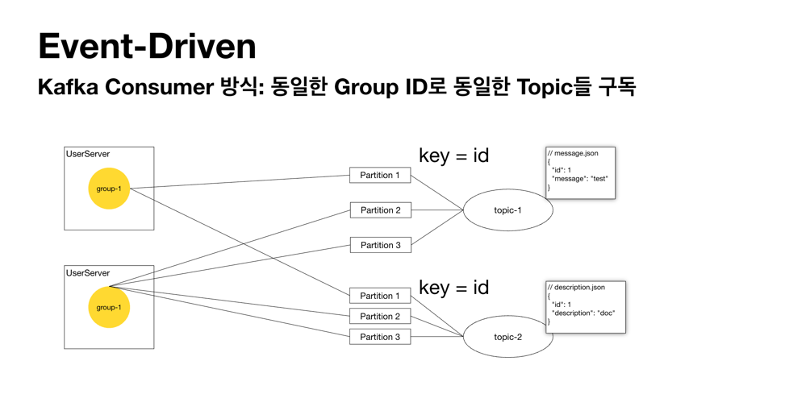
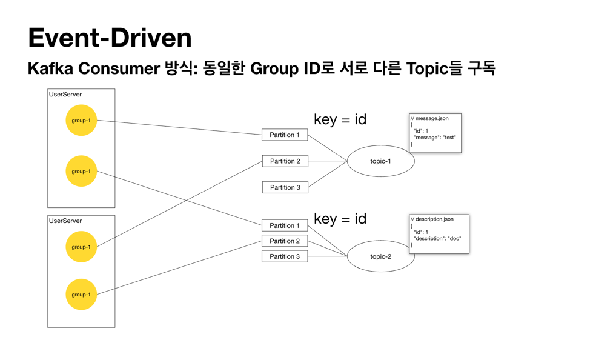

# Kafka Consumer Group 아키텍처 진화 과정 분석

## 1단계: 동일한 Group ID로 통일한 Topic 구독 방식

### 아키텍처 특징 
- 모든 UserServer 인스턴스가 동일한 `group-1` 사용
- 각 인스턴스에서 여러 토픽(topic-1, topic-2)을 동시 구독

**핵심 문제점**
- **Consumer 구현 복잡성**: 하나의 컨슈머가 서로 다른 메시지 타입을 처리해야 함
- **장애 전파**: 1개 connection에 문제 발생 시 모든 topic 처리가 중단
- **리밸런싱 이슈**: 파티션 재분배 시 모든 토픽에 영향

## 2단계: 동일한 Group ID로 서로 다른 Topic 구독 방식

**개선 시도:**
- UserServer별로 담당 토픽 분리 (topic-1 전담, topic-2 전담)
- 여전히 동일한 `group-1` 사용

**새로운 문제 발견:**
- **리밸런싱 혼란**: 한 인스턴스에 문제 발생 시, 동일한 Group ID로 인해 무관한 토픽까지 리밸런싱 발생
- **운영 복잡성**: 서로 다른 역할의 컨슈머가 같은 그룹으로 묶여 관리 어려움

## 3단계: 서로 다른 Group ID로 서로 다른 Topic 구독 (최종 채택)

### 최적화된 아키텍처
- topic-1 담당 컨슈머: `group-1-topic-1`
- topic-2 담당 컨슈머: `group-1-topic-2`
- 각각 독립적인 Consumer Group 형성

## 핵심 장점

### 1. 격리성 (Isolation)
- 각 토픽별 독립적인 리밸런싱
- 장애 전파 차단
- 토픽별 독립적인 오프셋 관리

### 2. 단순성 (Simplicity)
- 하나의 컨슈머 = 하나의 토픽
- 디버깅과 모니터링 용이성

### 3. 확장성 (Scalability)
- 토픽별 독립적인 스케일링
- 비즈니스 로직에 따른 개별 최적화 가능

## 인사이트

### 핵심 학습 포인트:
1. **명확한 책임 분리**: 각 컨슈머가 단일 토픽에 대한 명확한 책임
2. **에러 격리**: Go의 명시적 에러 핸들링과 같은 맥락의 장애 격리
3. **동시성 최적화**: 고루틴별 독립적인 처리 파이프라인 구성 가능

### 운영상 이점:
- **모니터링**: 토픽별 독립적인 메트릭 수집
- **배포**: 토픽별 독립적인 배포 전략 수립 가능
- **테스트**: 토픽별 단위 테스트 작성 용이