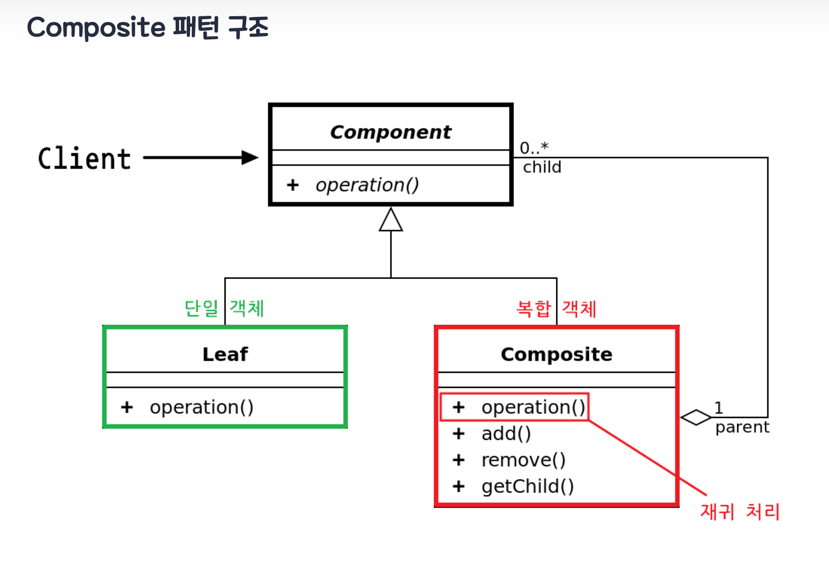
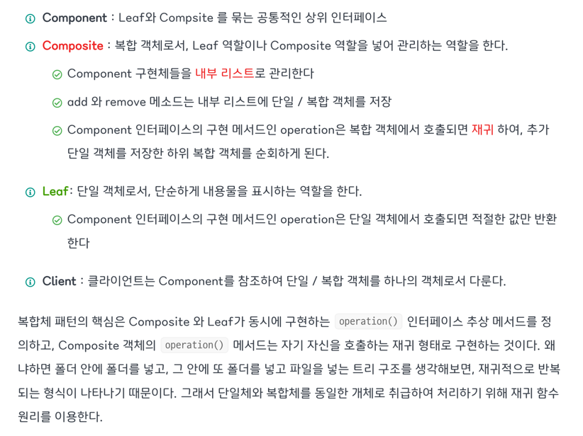

# 🦄 복합체(Composite) 패턴
복합체 패턴은 객체들을 트리 구조들로 구성한 후, 이러한 구조들을 개별 객체들처럼 다룰 수 있도록 하는 구조 패턴입니다. 
전체 트리 구조에 대해 재귀적으로 메서드들을 실행하고 결과를 요약하는 기능은 복합체의 훌륭한 기능 중 하나입니다.
>예) 폴더(디렉토리) 안에는 파일이 들어 있을수도 있고 파일을 담은 또 다른 폴더도 들어있을 수 있다. 
>이를 복합적으로 담을수 있다 해서 Composite 객체라고 불리운다. 반면 파일은 단일 객체 이기 때문에 이를 Leaf 객체라고 불리운다. 즉 Leaf는 자식이 없다.

출처 : [Inpa Dev](https://inpa.tistory.com/entry/GOF-%F0%9F%92%A0-%EB%B3%B5%ED%95%A9%EC%B2%B4Composite-%ED%8C%A8%ED%84%B4-%EC%99%84%EB%B2%BD-%EB%A7%88%EC%8A%A4%ED%84%B0%ED%95%98%EA%B8%B0)
